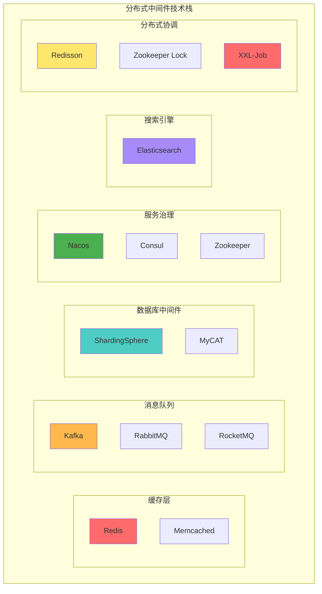

# 中间件学习项目 - 架构图谱

本项目整理了分布式系统中常用中间件的架构图和概念图，通过可视化的方式帮助理解各类中间件的工作原理、架构设计和应用场景。

## 项目简介

本项目使用 Mermaid 图表格式绘制了各类中间件的架构图，包括：
- 缓存层（Redis, Memcached）
- 消息队列（Kafka, RabbitMQ, RocketMQ）
- 数据库中间件（ShardingSphere, MyCAT）
- 服务治理（Nacos, Consul, Zookeeper）
- 搜索引擎（Elasticsearch）
- 分布式锁（Redisson, Zookeeper）
- 分布式任务调度（XXL-Job）

## 目录结构

```
middleware-study/
├── README.md                           # 项目总览
└── docs/
    └── architecture/                   # 架构图文档
        ├── 00-overview.md             # 中间件总览
        ├── 01-cache.md                # 缓存层架构
        ├── 02-message-queue.md        # 消息队列架构
        ├── 03-database-middleware.md  # 数据库中间件架构
        ├── 04-service-governance.md   # 服务治理架构
        ├── 05-elasticsearch.md        # Elasticsearch架构
        ├── 06-distributed-lock.md     # 分布式锁架构
        └── 07-xxl-job.md             # XXL-Job架构
```

## 快速导航

### 📋 [00. 中间件总览](docs/architecture/00-overview.md)
- 分布式系统中间件全景图
- 中间件分类说明
- 典型应用场景
- 中间件选型建议

### 🚀 [01. 缓存层架构](docs/architecture/01-cache.md)
#### Redis
- 单机架构
- 主从复制架构
- Sentinel 高可用架构
- Cluster 分片架构

#### Memcached
- 集群架构
- 内存结构（Slab分配器）

#### 对比与实践
- Redis vs Memcached 对比
- 缓存穿透、击穿、雪崩解决方案
- 数据库缓存架构
- 会话存储方案

### 📨 [02. 消息队列架构](docs/architecture/02-message-queue.md)
#### Kafka
- 集群架构
- Topic-Partition 模型
- 数据流转过程

#### RabbitMQ
- 集群架构
- 交换机类型（Direct, Fanout, Topic, Headers）
- 消息流转机制

#### RocketMQ
- 集群架构（NameServer + Broker）
- 消息类型（普通、顺序、事务、延时、批量）
- 事务消息流程

#### 对比与应用
- 三大消息队列对比
- 异步解耦场景
- 流量削峰场景
- 日志收集场景

### 🗄️ [03. 数据库中间件架构](docs/architecture/03-database-middleware.md)
#### ShardingSphere
- 生态架构（JDBC, Proxy, Sidecar）
- ShardingSphere-JDBC 架构
- 分库分表策略
- 读写分离架构

#### MyCAT
- 整体架构
- 逻辑库表映射
- 分片规则

#### 对比与实践
- ShardingSphere vs MyCAT
- 分布式事务解决方案
- 电商订单分库分表
- 用户数据水平分片

### 🎯 [04. 服务治理架构](docs/architecture/04-service-governance.md)
#### Nacos
- 整体架构
- 服务注册与发现
- 配置中心
- 命名空间与分组

#### Consul
- 集群架构
- 服务注册与健康检查
- 多数据中心

#### Zookeeper
- 集群架构
- 数据模型（ZNode树）
- 服务注册与发现
- Watch 机制

#### 对比与应用
- 三大服务治理组件对比
- CAP 理论定位
- 微服务架构
- 配置动态刷新
- 灰度发布场景

### 🔍 [05. Elasticsearch 架构](docs/architecture/05-elasticsearch.md)
#### 核心架构
- ES 集群架构
- 核心概念映射
- 倒排索引原理

#### 数据操作
- 写入流程（Refresh & Flush）
- 查询流程（Query Then Fetch）
- 聚合查询

#### 索引设计
- Mapping 映射设计
- 索引别名与模板
- 索引生命周期管理（ILM）

#### 应用场景
- ELK 日志分析架构
- 电商搜索架构
- 全文搜索优化

### 🔒 [06. 分布式锁架构](docs/architecture/06-distributed-lock.md)
#### Redisson
- 整体架构
- 可重入锁原理
- 数据结构（Hash + WatchDog）
- RedLock 算法

#### Zookeeper
- 锁架构
- 加锁流程（临时顺序节点）
- 锁特性分析

#### 数据库锁
- 悲观锁（SELECT FOR UPDATE）
- 乐观锁（版本号机制）

#### 对比与应用
- 三种实现方式对比
- CAP 理论视角
- 库存扣减防超卖
- 定时任务防重复
- 缓存重建防击穿

### ⏰ [07. XXL-Job 架构](docs/architecture/07-xxl-job.md)
#### 系统架构
- XXL-Job 系统架构
- 核心组件
- 时间轮调度算法

#### 调度机制
- 任务调度全流程
- 执行器注册与心跳
- 路由策略（轮询、随机、一致性Hash、分片广播等）

#### 执行策略
- 调度过期策略
- 阻塞处理策略
- 任务执行日志

#### 应用场景
- 数据同步任务
- 报表统计任务
- 大数据分片处理

## 中间件技术栈概览



## 学习路径建议

### 初级阶段
1. 从 [中间件总览](docs/architecture/00-overview.md) 开始，了解整体架构
2. 学习 [缓存层](docs/architecture/01-cache.md)，掌握 Redis 基础使用
3. 了解 [消息队列](docs/architecture/02-message-queue.md) 的基本概念

### 中级阶段
4. 深入 [服务治理](docs/architecture/04-service-governance.md)，理解微服务架构
5. 学习 [Elasticsearch](docs/architecture/05-elasticsearch.md) 搜索引擎
6. 掌握 [分布式锁](docs/architecture/06-distributed-lock.md) 的实现原理

### 高级阶段
7. 研究 [数据库中间件](docs/architecture/03-database-middleware.md) 分库分表方案
8. 实践 [XXL-Job](docs/architecture/07-xxl-job.md) 分布式任务调度
9. 综合运用各类中间件构建完整的分布式系统

## 实战应用场景

### 电商系统架构
```
用户请求 → API网关 → 微服务集群
                    ↓
         服务治理(Nacos) ← 配置中心
                    ↓
         缓存层(Redis) → 数据库中间件(ShardingSphere)
                    ↓
         消息队列(RocketMQ) → 异步处理
                    ↓
         搜索引擎(ES) → 商品搜索
                    ↓
         分布式锁(Redisson) → 库存扣减
                    ↓
         任务调度(XXL-Job) → 定时任务
```

### 大数据日志分析
```
应用日志 → Filebeat → Kafka → Logstash → Elasticsearch → Kibana
```

### 微服务治理
```
微服务 → Nacos(注册发现) → 配置中心
       → Redis(缓存) → 数据库
       → RocketMQ(异步) → 消费者
       → Redisson(分布式锁) → 并发控制
```

## 关键特性对比

| 中间件 | 类型 | 核心特性 | 适用场景 |
|--------|------|----------|----------|
| Redis | 缓存 | 高性能、数据结构丰富 | 缓存、会话、计数器 |
| Kafka | 消息队列 | 高吞吐量、持久化 | 日志收集、流式计算 |
| RabbitMQ | 消息队列 | 可靠性高、路由灵活 | 业务解耦、异步处理 |
| Nacos | 服务治理 | 注册发现、配置管理 | 微服务架构 |
| Elasticsearch | 搜索引擎 | 全文搜索、分析 | 日志分析、商品搜索 |
| ShardingSphere | 数据库中间件 | 分库分表、读写分离 | 数据量大、高并发 |
| Redisson | 分布式锁 | 性能高、易使用 | 防超卖、防重复 |
| XXL-Job | 任务调度 | 轻量级、分片广播 | 定时任务、数据同步 |

## 性能与可靠性

### 性能排行（同类对比）
- 缓存：Redis > Memcached
- 消息队列：Kafka > RocketMQ > RabbitMQ（吞吐量）
- 服务治理：Nacos ≈ Consul > Zookeeper（性能）
- 分布式锁：Redis(Redisson) > Zookeeper > 数据库

### 可靠性排行（同类对比）
- 消息队列：RabbitMQ > RocketMQ > Kafka（消息可靠性）
- 服务治理：Zookeeper > Consul > Nacos（一致性）
- 分布式锁：Zookeeper > Redis(RedLock) > Redis(单机)

## 技术选型建议

### 互联网公司
- 缓存：Redis
- 消息队列：Kafka（日志）+ RocketMQ（业务）
- 服务治理：Nacos
- 搜索：Elasticsearch
- 数据库中间件：ShardingSphere
- 分布式锁：Redisson
- 任务调度：XXL-Job

### 金融行业
- 缓存：Redis 集群
- 消息队列：RabbitMQ（可靠性优先）
- 服务治理：Zookeeper 或 Consul
- 数据库中间件：ShardingSphere
- 分布式锁：Zookeeper
- 任务调度：XXL-Job

### 传统企业
- 缓存：Redis 主从
- 消息队列：RabbitMQ
- 服务治理：Nacos
- 数据库中间件：MyCAT
- 分布式锁：Redis 或 数据库锁
- 任务调度：XXL-Job

## 学习资源

### 官方文档
- [Redis 官方文档](https://redis.io/docs/)
- [Kafka 官方文档](https://kafka.apache.org/documentation/)
- [Nacos 官方文档](https://nacos.io/docs/)
- [Elasticsearch 官方文档](https://www.elastic.co/guide/en/elasticsearch/reference/current/index.html)
- [XXL-Job 官方文档](https://www.xuxueli.com/xxl-job/)

### 推荐书籍
- 《Redis 设计与实现》
- 《Kafka 权威指南》
- 《Elasticsearch 权威指南》
- 《分布式服务架构：原理、设计与实战》

## 贡献指南

欢迎提交 Issue 和 Pull Request 来完善本项目的架构图和文档。

## 许可证

本项目采用 MIT 许可证。

## 联系方式

如有问题或建议，欢迎通过 Issue 联系。

---

**最后更新时间**: 2024

**维护状态**: 持续更新中
