# 中间件架构总览

## 分布式系统中间件全景图

```mermaid
graph TB
    subgraph "应用层"
        APP1[微服务应用 A]
        APP2[微服务应用 B]
        APP3[微服务应用 C]
    end

    subgraph "服务治理层"
        NACOS[Nacos<br/>服务注册与配置]
        CONSUL[Consul<br/>服务发现]
        ZK[Zookeeper<br/>协调服务]
    end

    subgraph "缓存层"
        REDIS[Redis<br/>高性能缓存]
        MEMCACHED[Memcached<br/>分布式缓存]
    end

    subgraph "消息队列层"
        KAFKA[Kafka<br/>高吞吐消息队列]
        RABBITMQ[RabbitMQ<br/>消息代理]
        ROCKETMQ[RocketMQ<br/>分布式消息]
    end

    subgraph "数据持久层"
        SHARDING[ShardingSphere<br/>分库分表]
        MYCAT[MyCAT<br/>数据库中间件]
        ES[Elasticsearch<br/>搜索引擎]
    end

    subgraph "分布式协调层"
        REDISSON[Redisson<br/>分布式锁]
        ZKLOCK[Zookeeper Lock<br/>分布式协调]
        XXLJOB[XXL-Job<br/>任务调度]
    end

    subgraph "数据库层"
        DB1[(数据库1)]
        DB2[(数据库2)]
        DB3[(数据库3)]
    end

    %% 应用层连接
    APP1 --> NACOS
    APP2 --> NACOS
    APP3 --> NACOS

    APP1 --> REDIS
    APP2 --> REDIS
    APP3 --> MEMCACHED

    APP1 --> KAFKA
    APP2 --> RABBITMQ
    APP3 --> ROCKETMQ

    APP1 --> SHARDING
    APP2 --> MYCAT
    APP3 --> ES

    APP1 --> REDISSON
    APP2 --> XXLJOB

    %% 服务治理层
    NACOS -.注册.-> ZK
    CONSUL -.协调.-> ZK

    %% 数据层连接
    SHARDING --> DB1
    SHARDING --> DB2
    MYCAT --> DB2
    MYCAT --> DB3

    %% 分布式锁连接
    REDISSON -.基于.-> REDIS
    ZKLOCK -.基于.-> ZK

    %% 任务调度连接
    XXLJOB --> DB1

    style NACOS fill:#4CAF50
    style CONSUL fill:#4CAF50
    style ZK fill:#4CAF50

    style REDIS fill:#FF6B6B
    style MEMCACHED fill:#FF6B6B

    style KAFKA fill:#FFB84D
    style RABBITMQ fill:#FFB84D
    style ROCKETMQ fill:#FFB84D

    style SHARDING fill:#4ECDC4
    style MYCAT fill:#4ECDC4
    style ES fill:#4ECDC4

    style REDISSON fill:#A78BFA
    style ZKLOCK fill:#A78BFA
    style XXLJOB fill:#A78BFA
```



## 中间件分类说明

### 1. 服务治理层 (绿色)
- **Nacos**: 阿里巴巴开源的服务注册、配置管理平台
- **Consul**: HashiCorp 的服务网格解决方案
- **Zookeeper**: Apache 分布式协调服务

### 2. 缓存层 (红色)
- **Redis**: 高性能键值存储，支持多种数据结构
- **Memcached**: 简单高效的分布式内存缓存系统

### 3. 消息队列层 (橙色)
- **Kafka**: 高吞吐量的分布式发布订阅消息系统
- **RabbitMQ**: 基于 AMQP 协议的可靠消息代理
- **RocketMQ**: 阿里巴巴开源的分布式消息中间件

### 4. 数据持久层 (青色)
- **ShardingSphere**: 数据分片、读写分离的生态系统
- **MyCAT**: 数据库分库分表中间件
- **Elasticsearch**: 分布式搜索和分析引擎

### 5. 分布式协调层 (紫色)
- **Redisson**: 基于 Redis 的分布式对象和服务框架
- **Zookeeper Lock**: 基于 Zookeeper 的分布式锁实现
- **XXL-Job**: 分布式任务调度平台

## 典型应用场景

### 场景1：高并发读写系统
```
应用 → 缓存层(Redis) → 数据库中间件(ShardingSphere) → 分库分表
```

### 场景2：异步处理系统
```
应用 → 消息队列(Kafka) → 消费者应用 → 数据库
```

### 场景3：微服务架构
```
微服务 → 服务治理(Nacos) ← 其他微服务
       → 分布式锁(Redisson)
       → 任务调度(XXL-Job)
```

### 场景4：搜索系统
```
应用 → Elasticsearch ← 数据同步 ← 数据库
```

## 中间件选型建议

| 场景 | 推荐中间件 | 理由 |
|------|-----------|------|
| 服务注册发现 | Nacos | 功能全面，支持配置管理 |
| 高性能缓存 | Redis | 功能丰富，生态完善 |
| 消息队列-日志 | Kafka | 高吞吐量，适合大数据 |
| 消息队列-业务 | RabbitMQ | 可靠性高，功能完整 |
| 分库分表 | ShardingSphere | 支持多种数据库，生态好 |
| 全文搜索 | Elasticsearch | 功能强大，易于扩展 |
| 分布式锁 | Redisson | 性能好，使用简单 |
| 任务调度 | XXL-Job | 轻量级，易于集成 |
