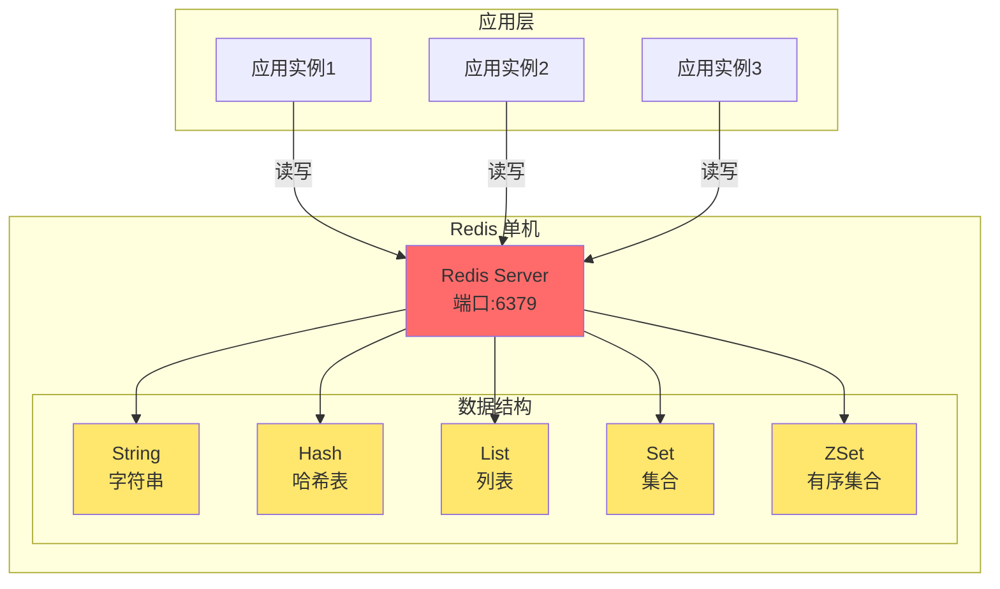
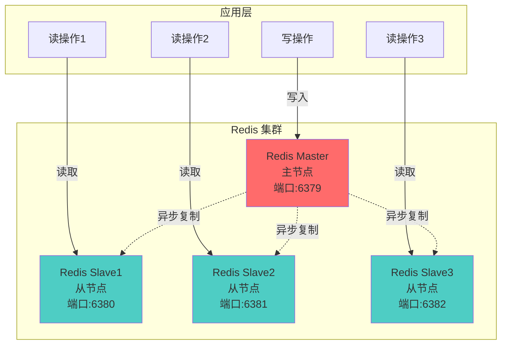
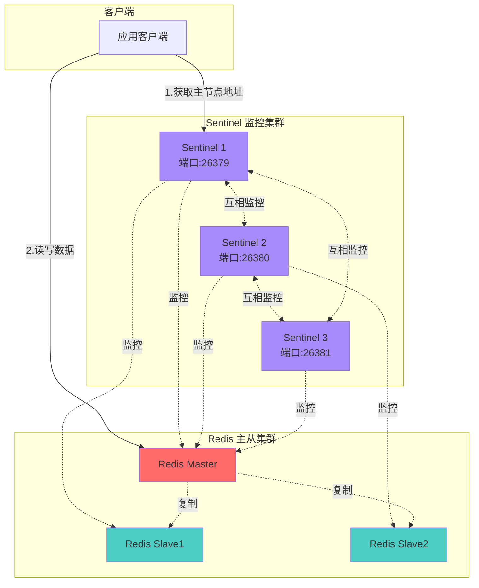
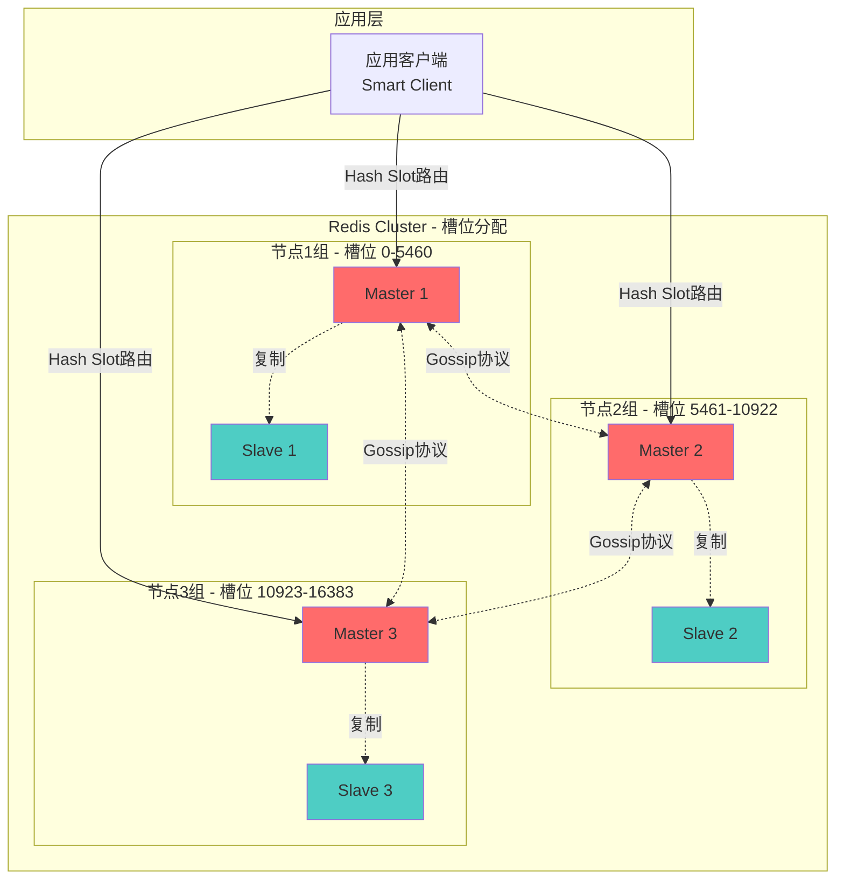
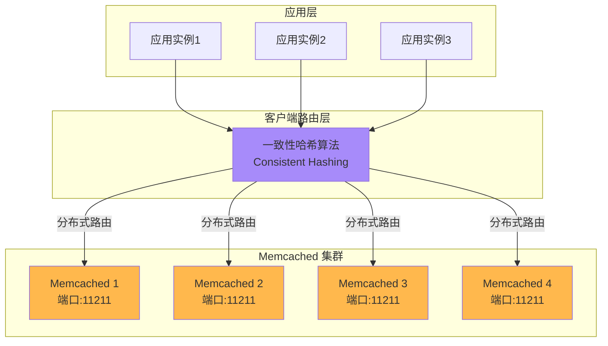
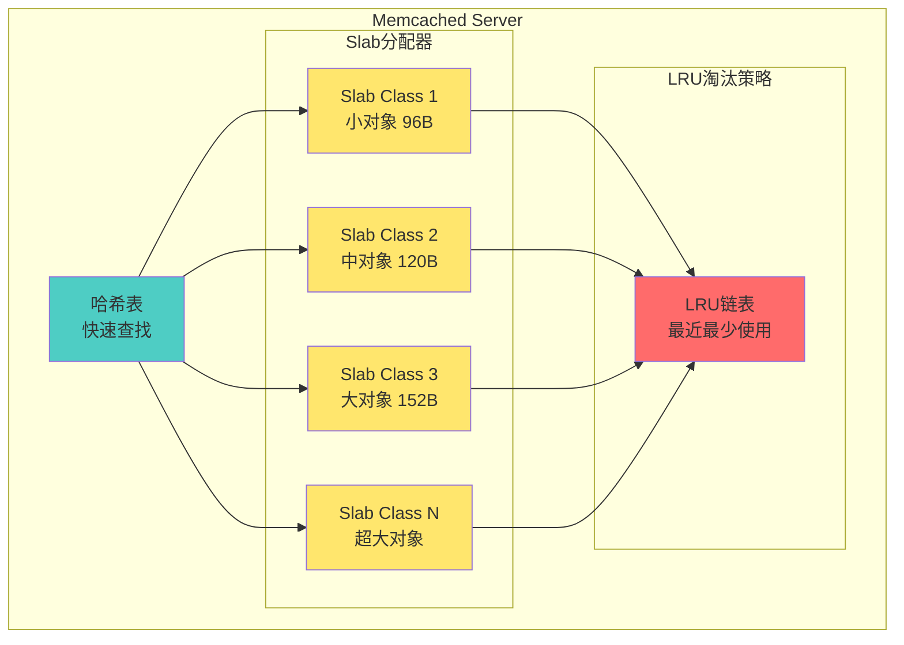
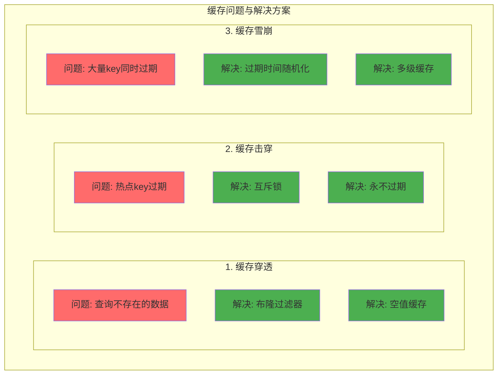
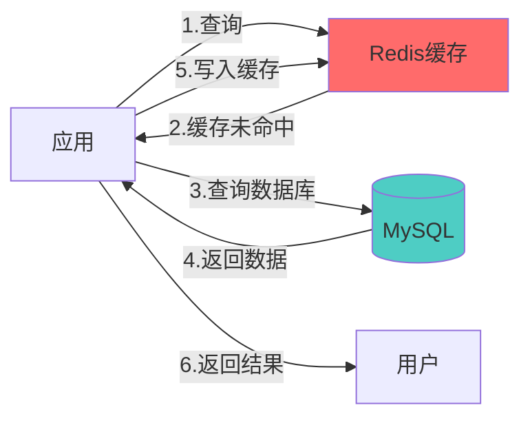
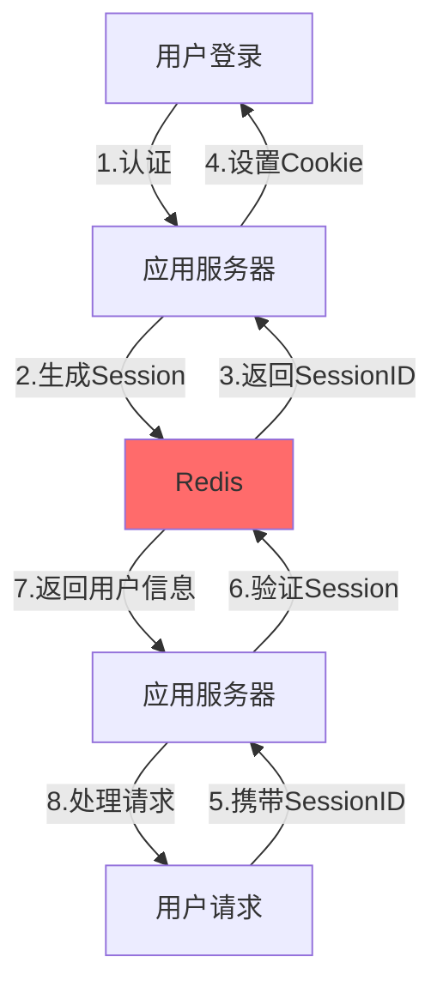

# 缓存层架构

## Redis 架构详解

### 1. Redis 单机架构

### 2. Redis 主从复制架构

### 3. Redis Sentinel 高可用架构

### 4. Redis Cluster 分片架构

## Memcached 架构详解

### 1. Memcached 集群架构

### 2. Memcached 内存结构

## Redis vs Memcached 对比

### 缓存穿透、击穿、雪崩解决方案

## 典型应用场景

### 1. 数据库缓存架构

### 2. 会话存储

## 最佳实践建议

### Redis 使用场景
- ✅ 数据结构丰富的场景（List、Set、ZSet等）
- ✅ 需要持久化的缓存数据
- ✅ 发布订阅模式
- ✅ 分布式锁
- ✅ 高可用要求（支持主从、Sentinel、Cluster）

### Memcached 使用场景
- ✅ 简单的 Key-Value 缓存
- ✅ 纯内存缓存，不需要持久化
- ✅ 多线程模型，适合多核 CPU
- ✅ 更少的内存开销

### 性能优化建议
1. **合理设置过期时间**：避免内存溢出
2. **使用连接池**：减少连接开销
3. **避免大 Key**：影响性能和内存
4. **批量操作**：使用 pipeline 或 mget/mset
5. **监控告警**：内存使用率、命中率、慢查询
