# 消息队列架构

## Kafka 架构详解

### 1. Kafka 集群架构
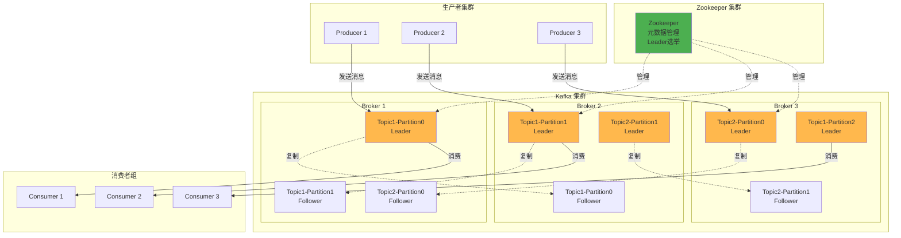

### 2. Kafka Topic-Partition 模型
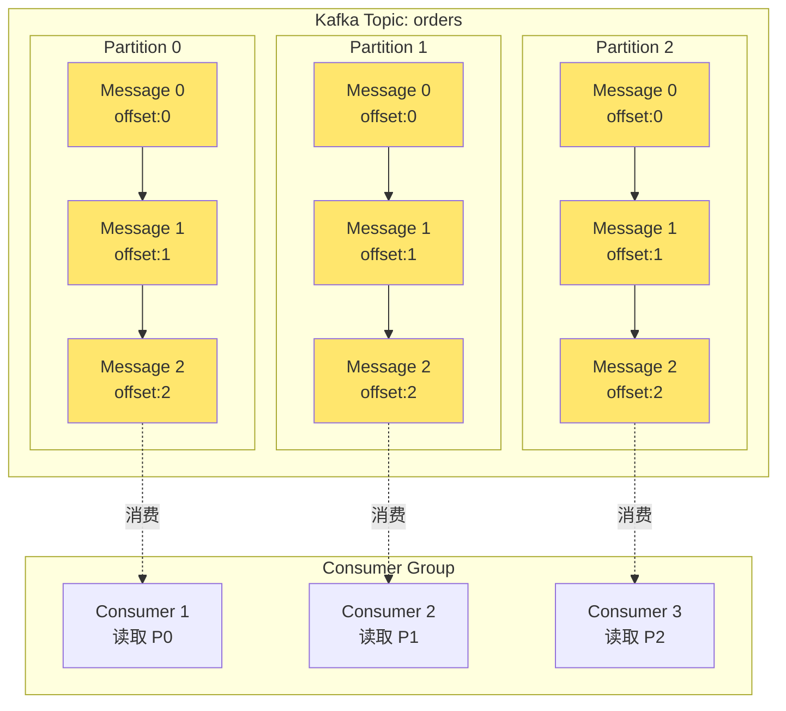

### 3. Kafka 数据流转过程
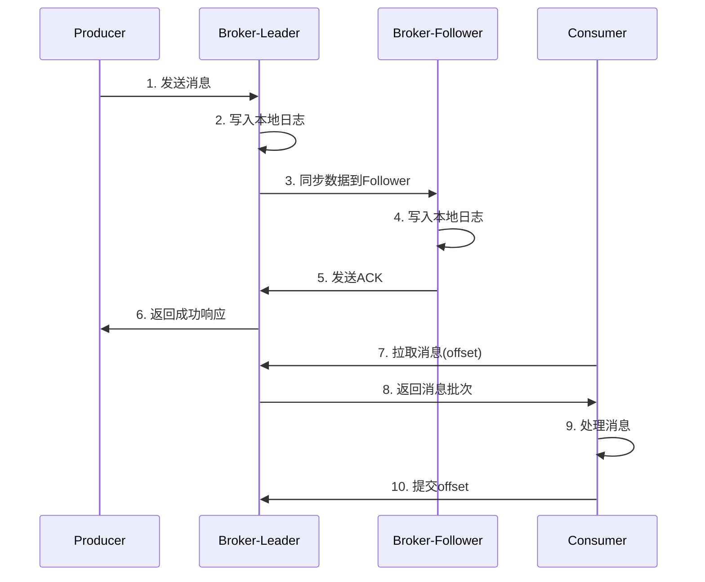

## RabbitMQ 架构详解

### 1. RabbitMQ 集群架构
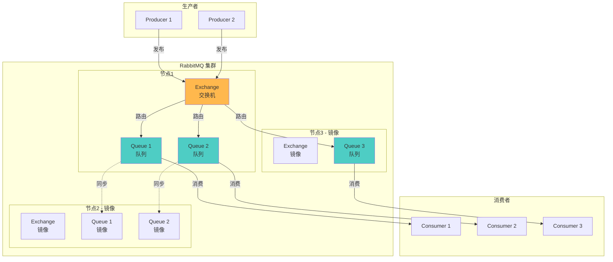

### 2. RabbitMQ 交换机类型
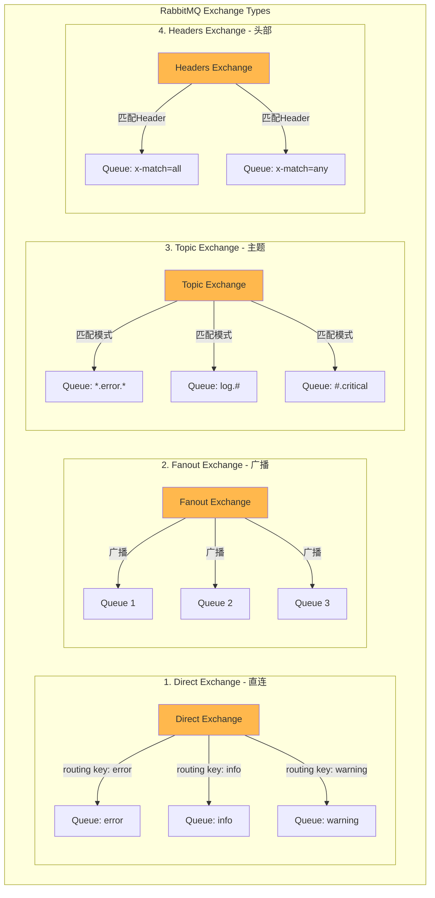

### 3. RabbitMQ 消息流转
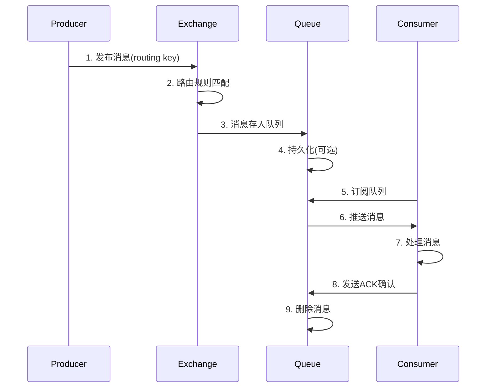

## RocketMQ 架构详解

### 1. RocketMQ 集群架构
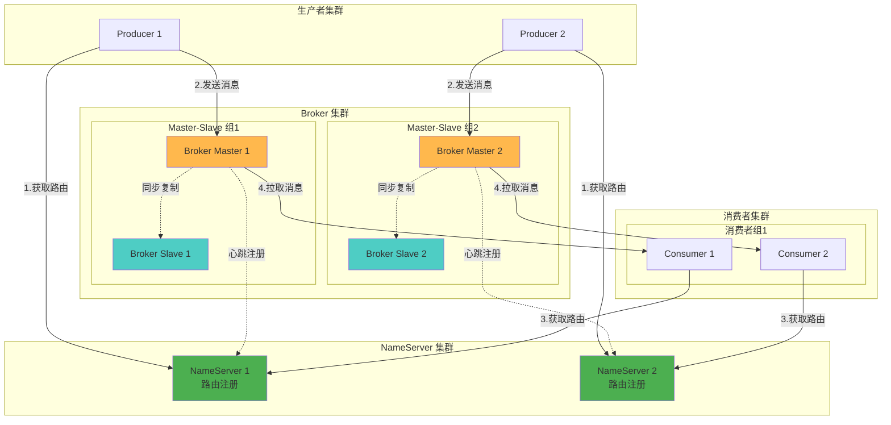

### 2. RocketMQ 消息类型
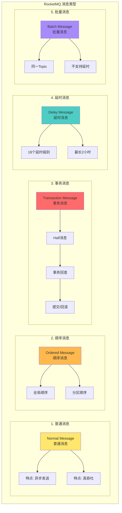

### 3. RocketMQ 事务消息流程
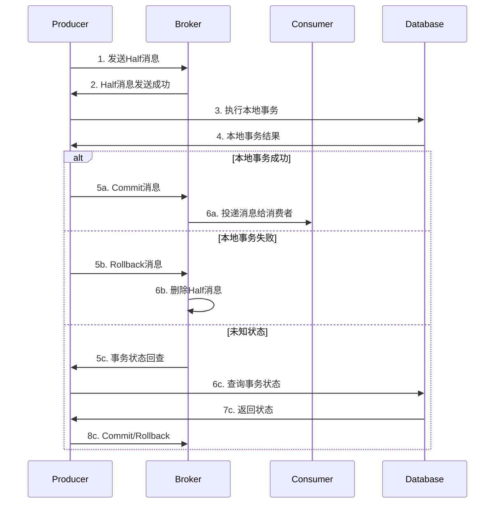

## 三大消息队列对比

### 架构对比
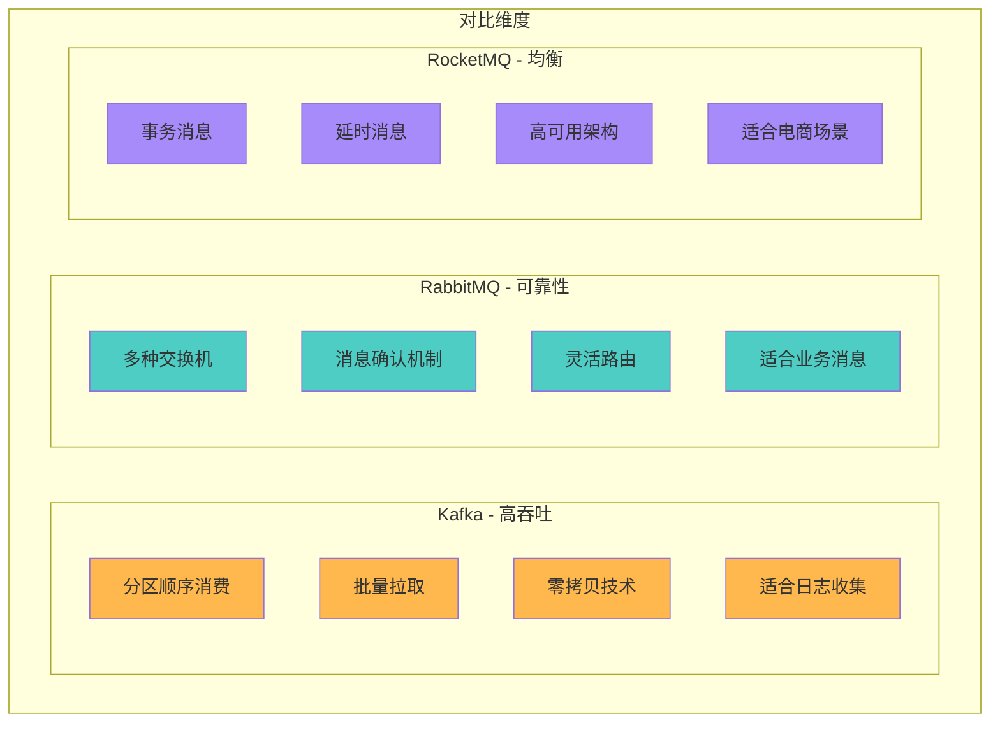

## 典型应用场景

### 1. 异步解耦场景
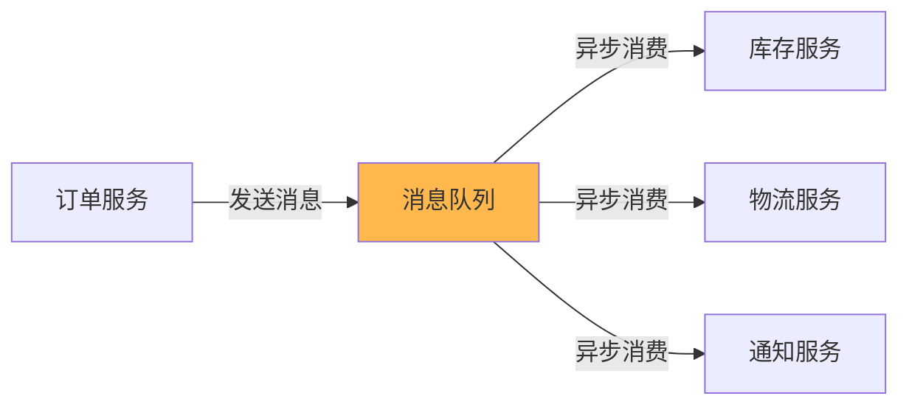

### 2. 流量削峰场景
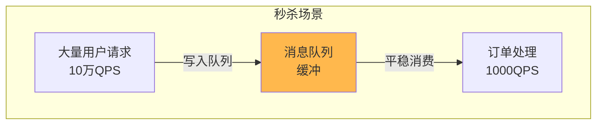

### 3. 日志收集场景
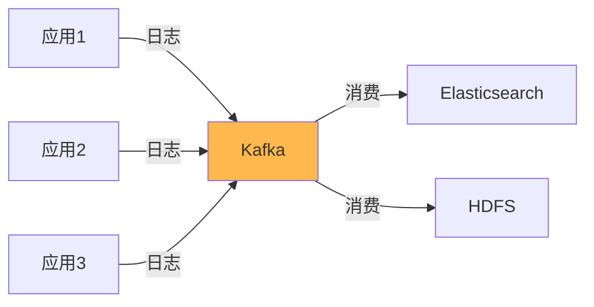

## 选型建议

| 场景 | 推荐MQ | 理由 |
|------|--------|------|
| 日志收集、大数据 | Kafka | 超高吞吐量，批量处理 |
| 金融交易、订单 | RabbitMQ | 消息可靠性高，支持事务 |
| 电商业务 | RocketMQ | 功能全面，支持事务和延时 |
| 实时计算 | Kafka | 流式处理，低延迟 |
| 复杂路由 | RabbitMQ | 多种交换机类型 |

## 最佳实践

### 1. 消息幂等性处理
- 使用全局唯一消息ID
- 业务侧去重表
- 利用数据库唯一约束

### 2. 消息顺序性保证
- Kafka: 单分区内有序
- RabbitMQ: 单队列有序
- RocketMQ: 使用MessageQueueSelector

### 3. 消息可靠性保证
- 生产者确认机制（ACK）
- 消息持久化
- 消费者手动确认
- 死信队列处理失败消息

### 4. 性能优化
- 批量发送和消费
- 异步发送
- 合理设置分区数
- 消费者并发度调优
