# 数据库中间件架构

## ShardingSphere 架构详解

### 1. ShardingSphere 生态架构
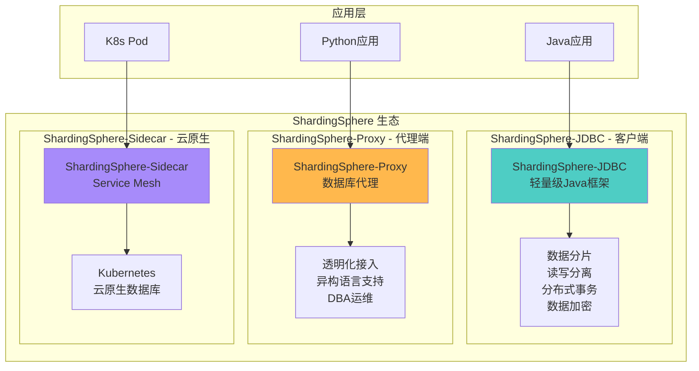

### 2. ShardingSphere-JDBC 架构
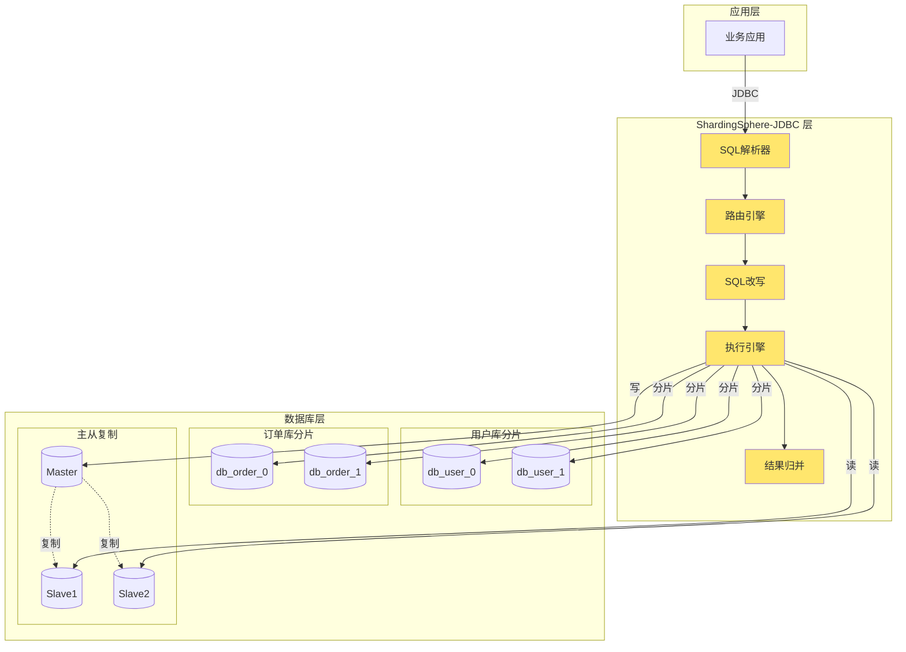

### 3. 分库分表策略
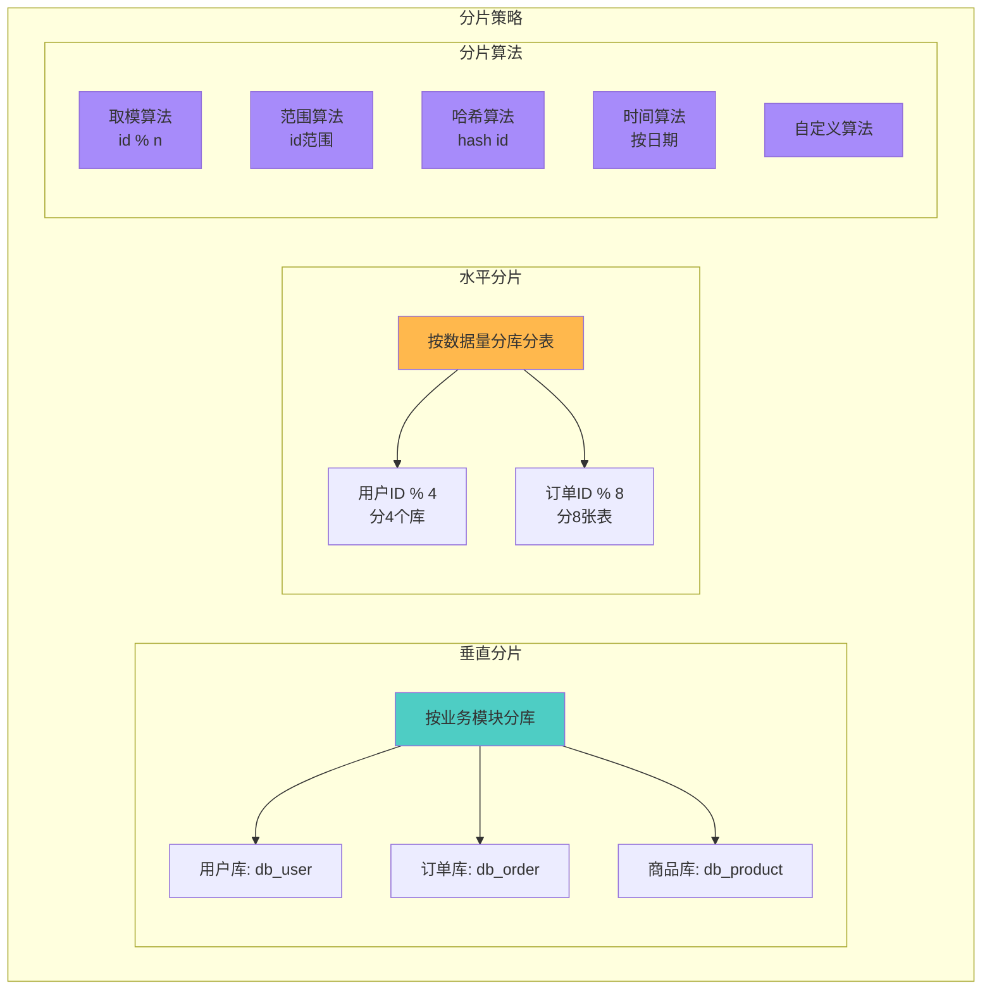

### 4. 读写分离架构
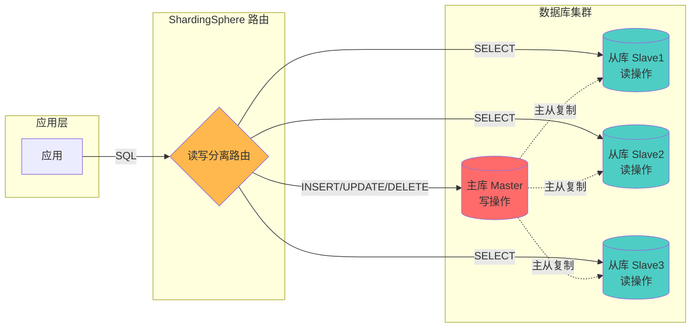

## MyCAT 架构详解

### 1. MyCAT 整体架构
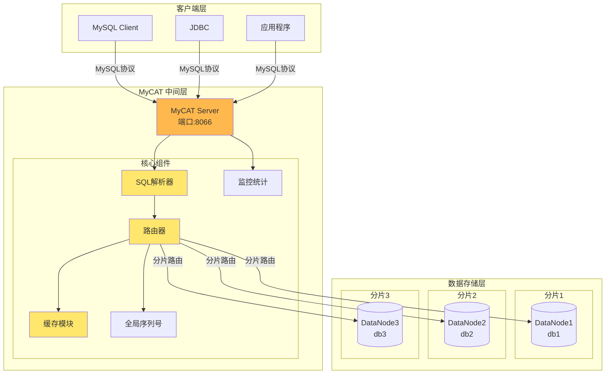

### 2. MyCAT 逻辑库表映射
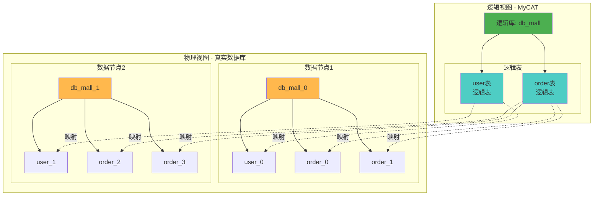

### 3. MyCAT 分片规则
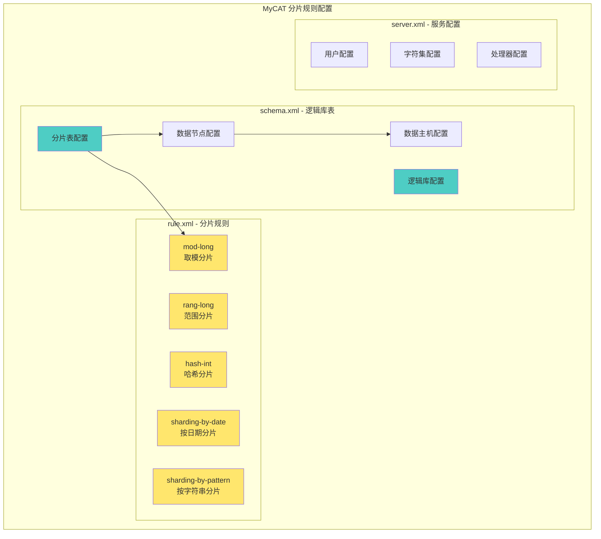

## ShardingSphere vs MyCAT 对比

### 架构对比
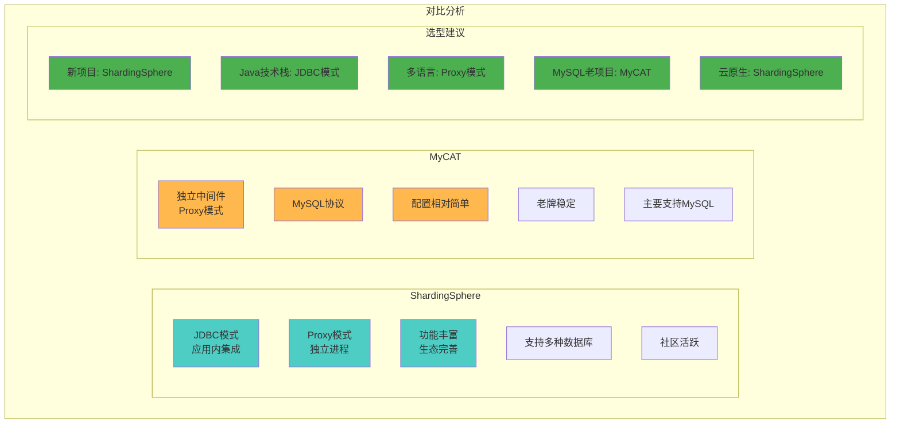

## 分布式事务解决方案

### 1. ShardingSphere 分布式事务
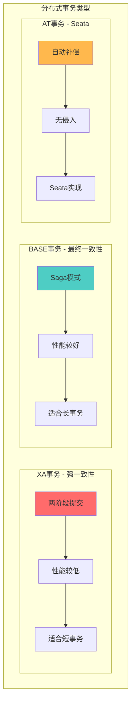

### 2. 分布式事务执行流程
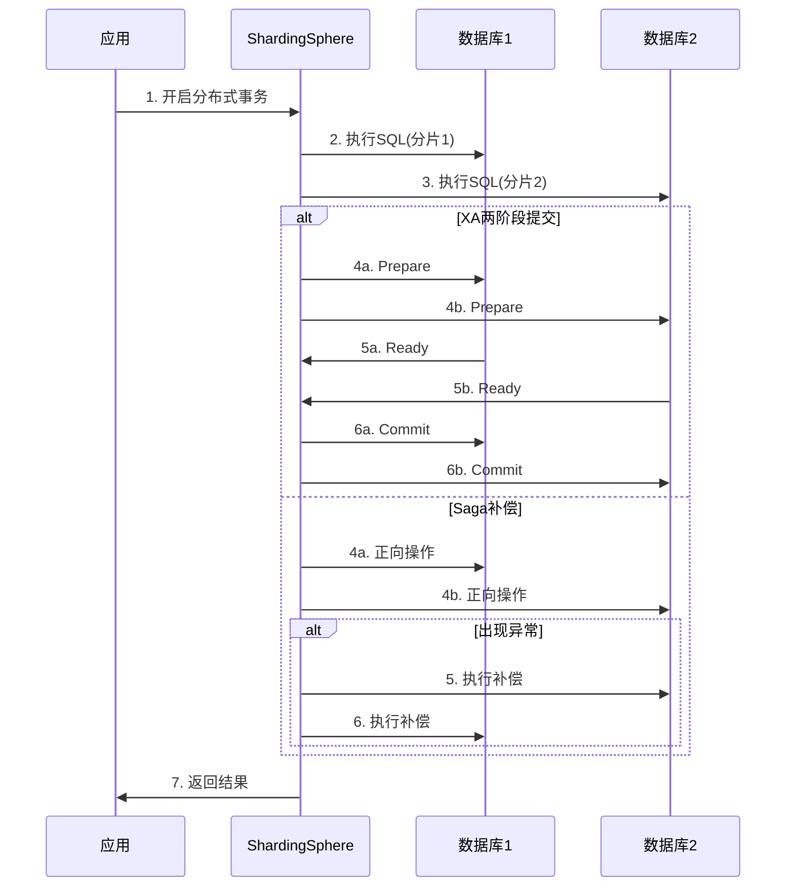

## 典型应用场景

### 1. 电商订单分库分表
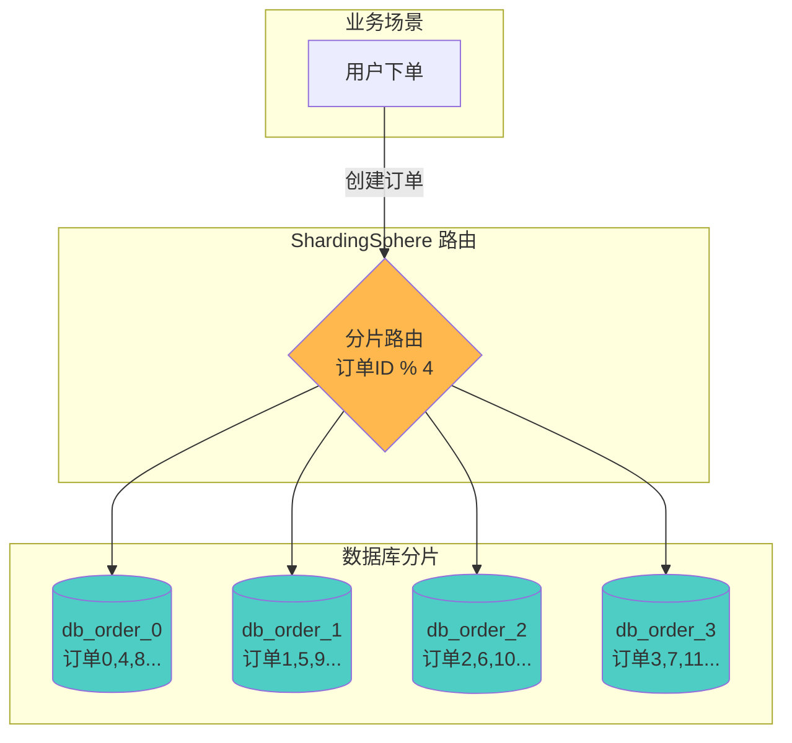

### 2. 用户数据水平分片
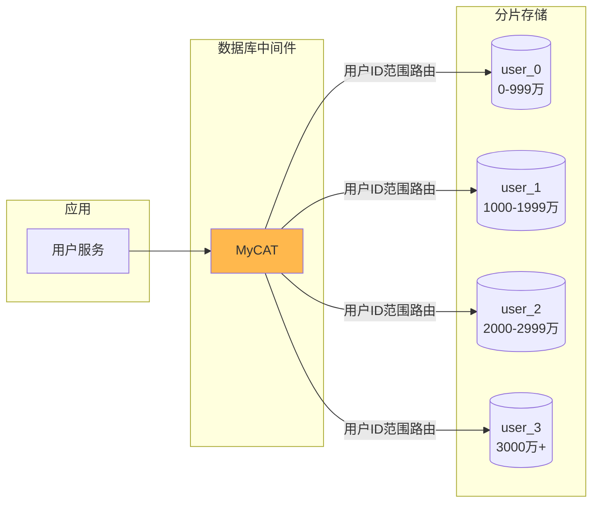

## 最佳实践建议

### 1. 分片键选择
- ✅ 选择高频查询字段
- ✅ 数据分布均匀的字段
- ✅ 避免频繁跨分片查询
- ❌ 避免使用时间戳（数据倾斜）

### 2. 全局主键生成
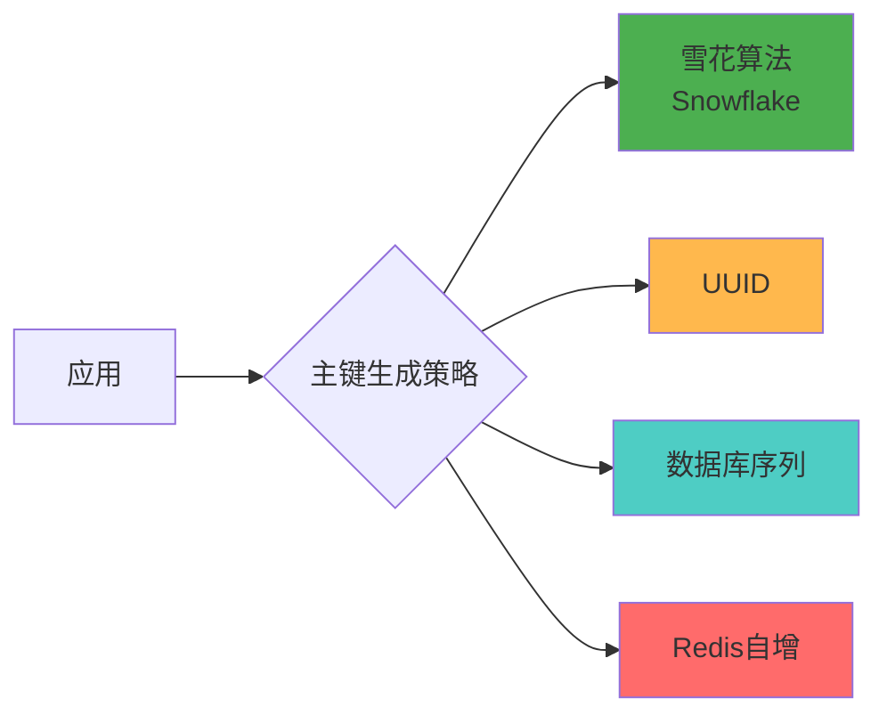

### 3. 跨分片查询优化
- 避免全表扫描
- 使用绑定表（关联表同分片键）
- 广播表（小表冗余到所有分片）
- 数据汇总到ES或数仓

### 4. 扩容策略
- 双倍扩容法（2→4→8）
- 平滑数据迁移
- 使用一致性哈希算法
- 预留扩容空间

### 5. 监控告警
- SQL执行时间监控
- 分片数据倾斜检测
- 连接池使用率
- 慢SQL分析
