# 服务治理架构

## Nacos 架构详解

### 1. Nacos 整体架构
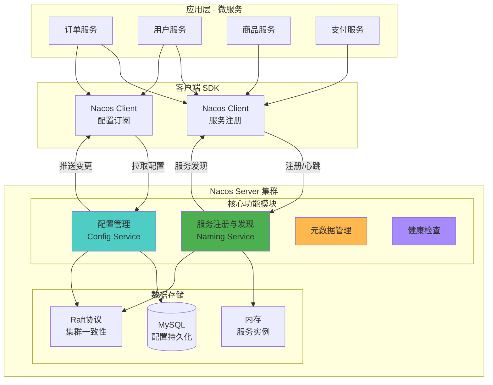

### 2. Nacos 服务注册与发现
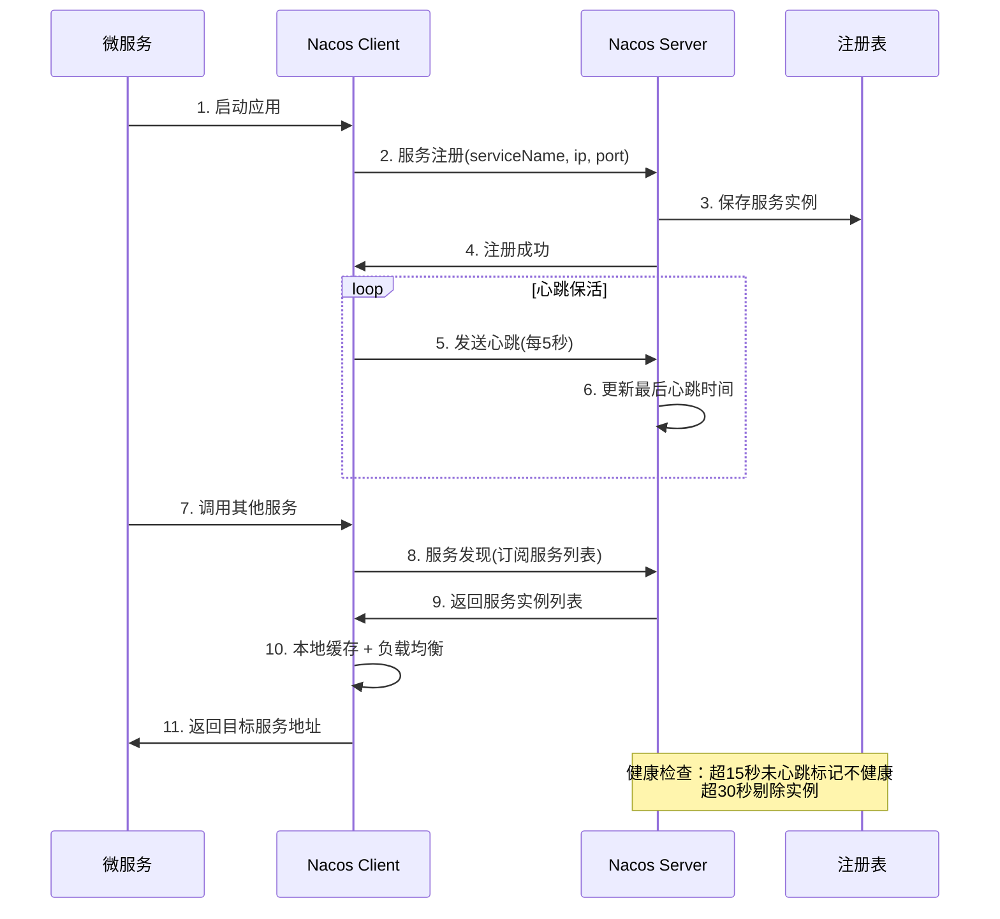

### 3. Nacos 配置中心
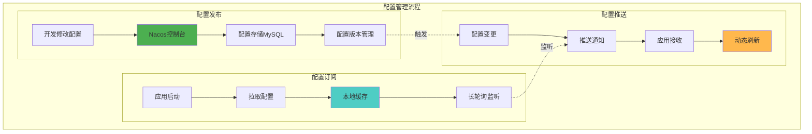

### 4. Nacos 命名空间与分组
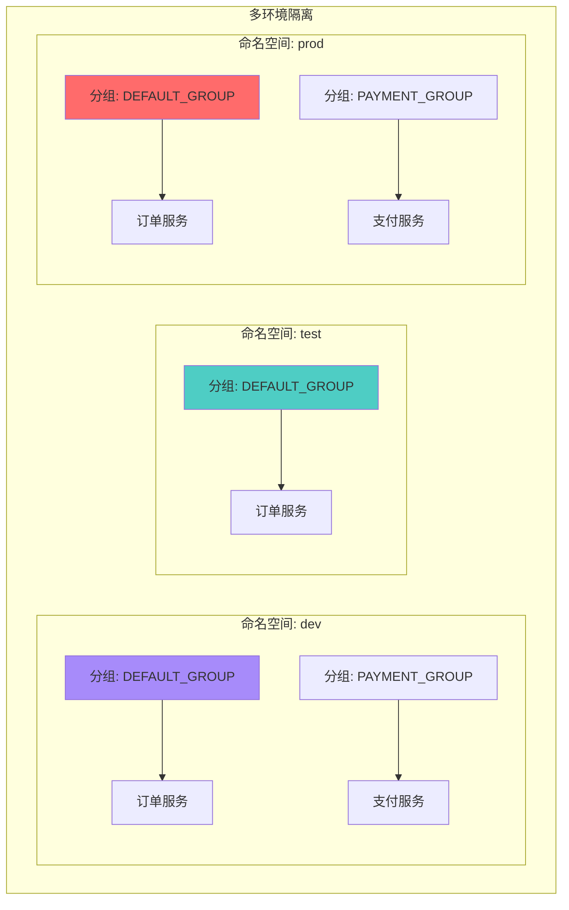

## Consul 架构详解

### 1. Consul 集群架构
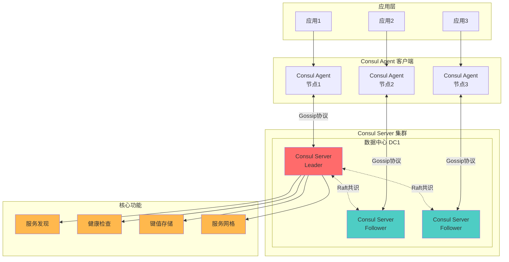

### 2. Consul 服务注册与健康检查
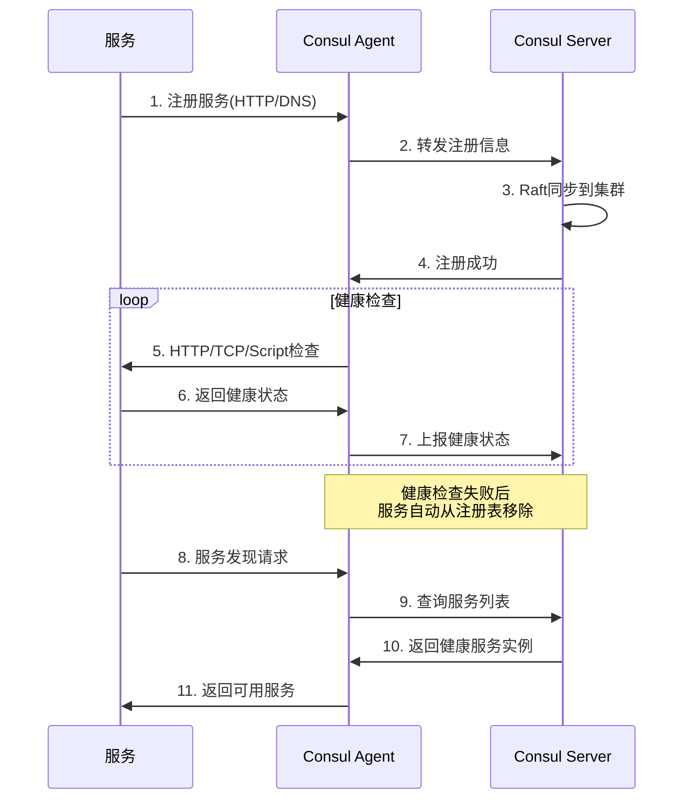

### 3. Consul 多数据中心
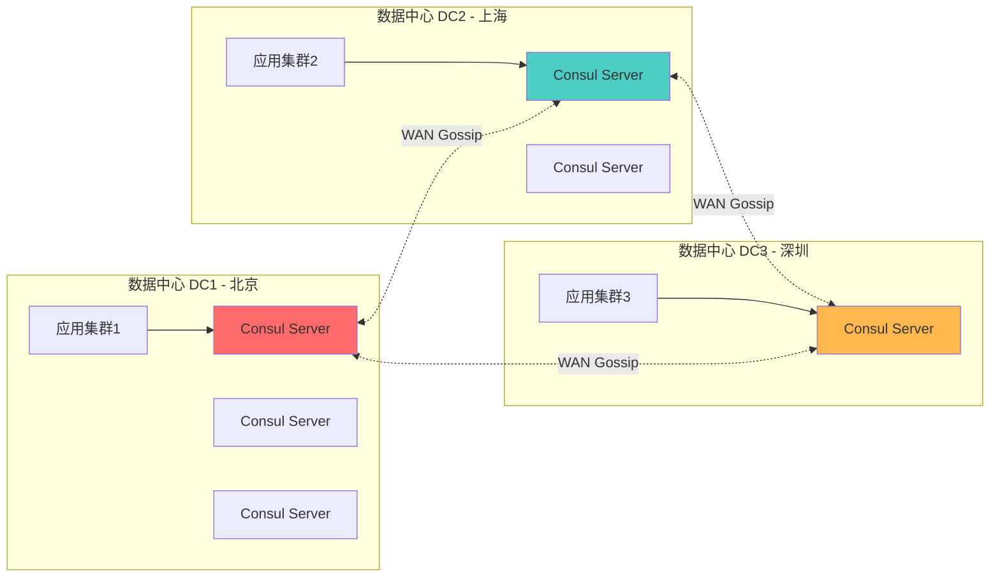

## Zookeeper 架构详解

### 1. Zookeeper 集群架构
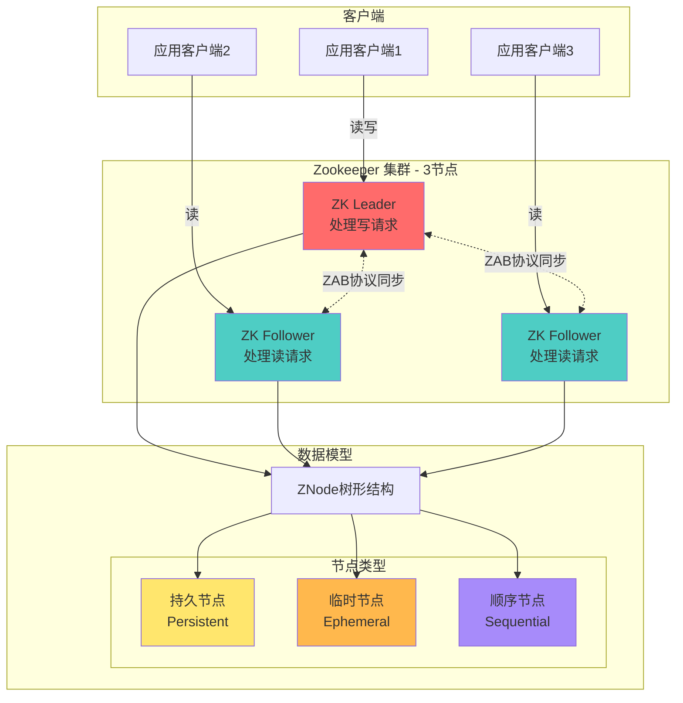

### 2. Zookeeper 数据模型
```mermaid
graph TB
    ROOT[/ 根节点]

    ROOT --> SERVICES[/services]
    ROOT --> CONFIG[/config]
    ROOT --> LOCKS[/locks]

    SERVICES --> ORDER[/order-service]
    SERVICES --> USER[/user-service]

    ORDER --> INSTANCE1[/instance-001<br/>临时顺序节点]
    ORDER --> INSTANCE2[/instance-002<br/>临时顺序节点]

    USER --> INSTANCE3[/instance-001<br/>临时顺序节点]

    CONFIG --> DB[/database<br/>持久节点]
    CONFIG --> REDIS[/redis<br/>持久节点]

    LOCKS --> LOCK1[/lock-0000000001<br/>临时顺序节点]
    LOCKS --> LOCK2[/lock-0000000002<br/>临时顺序节点]

    style ROOT fill:#4CAF50
    style SERVICES fill:#4ECDC4
    style CONFIG fill:#FFB84D
    style LOCKS fill:#FF6B6B
```

### 3. Zookeeper 服务注册与发现
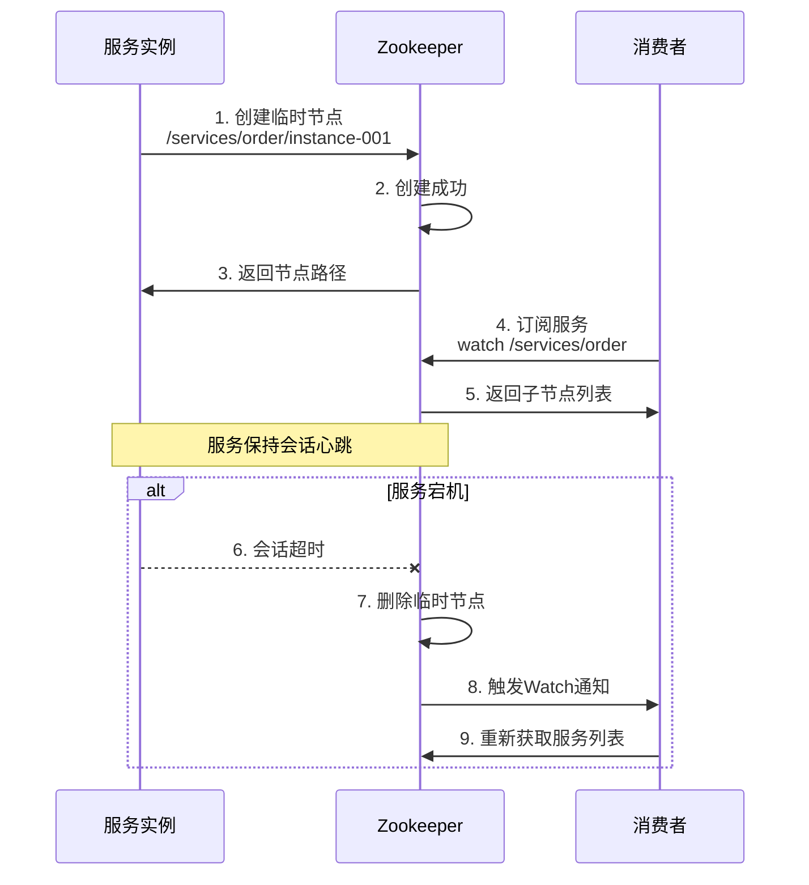

### 4. Zookeeper Watch 机制
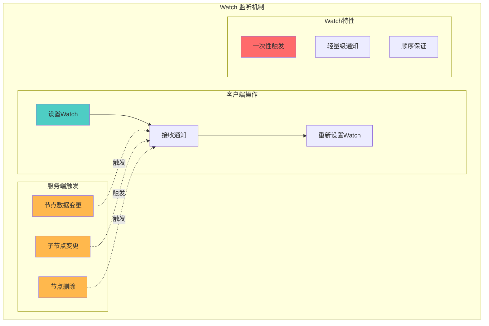

## 三大服务治理组件对比

### 功能对比
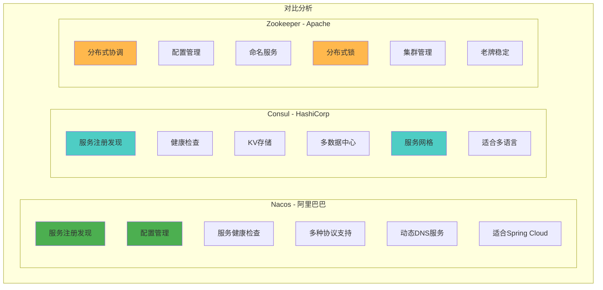

### CAP 理论定位
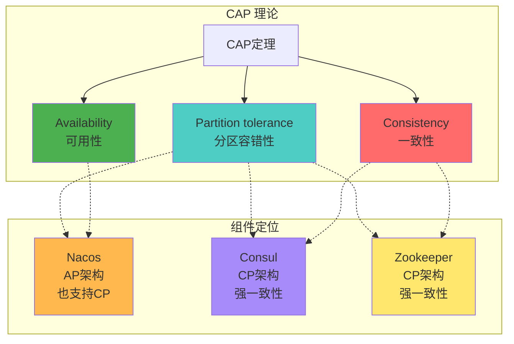

## 典型应用场景

### 1. 微服务架构
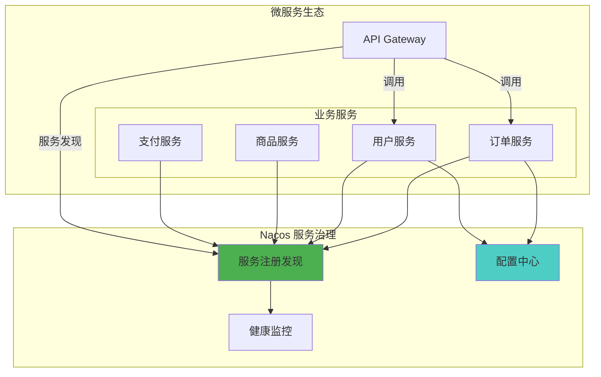

### 2. 配置动态刷新
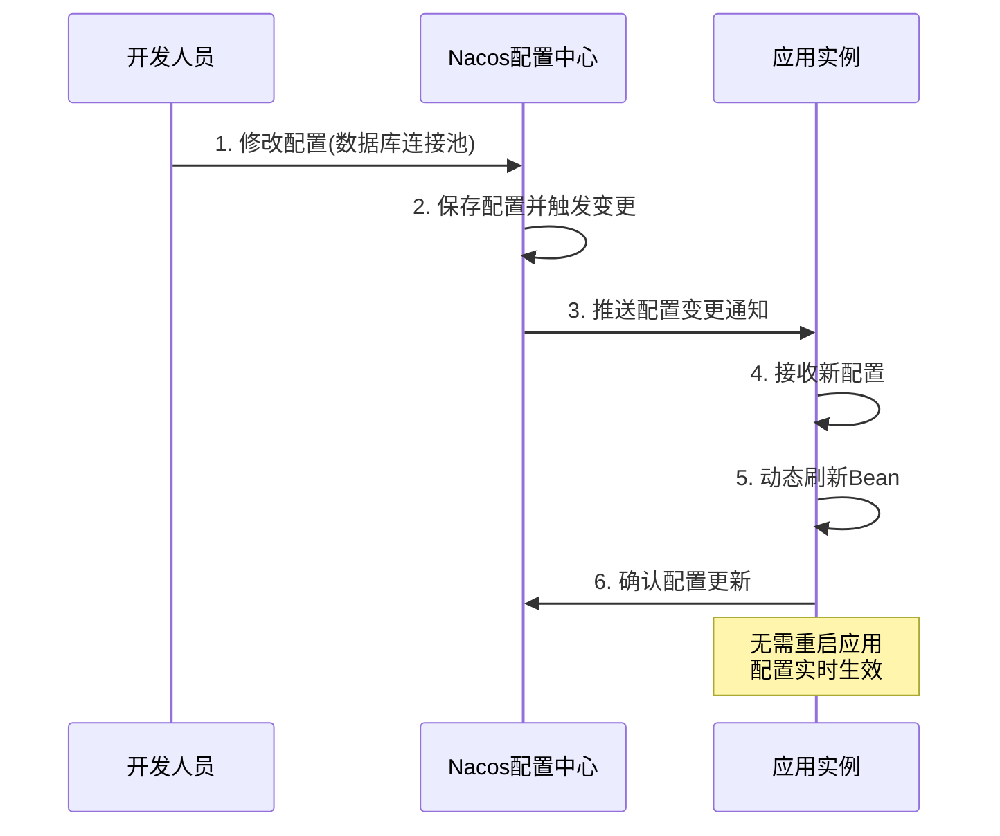

### 3. 灰度发布场景
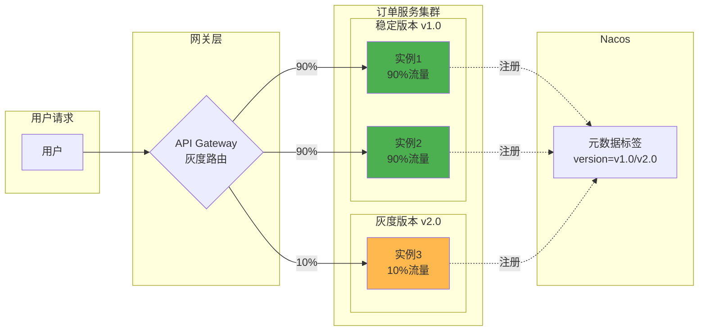

## 最佳实践建议

### 1. 选型建议

| 场景 | 推荐组件 | 理由 |
|------|---------|------|
| Spring Cloud 微服务 | Nacos | 与生态深度集成，功能全面 |
| 多语言微服务 | Consul | 支持多语言，HTTP API |
| 分布式协调、锁 | Zookeeper | 成熟稳定，CP架构 |
| 需要配置中心 | Nacos | 配置管理功能强大 |
| 服务网格 | Consul | 原生支持Service Mesh |
| 老系统改造 | Zookeeper | 兼容性好，稳定 |

### 2. Nacos 最佳实践
- 合理划分命名空间（dev/test/prod）
- 使用分组隔离不同业务模块
- 配置文件使用 YAML 格式，便于管理
- 开启鉴权，保证安全性
- 集群部署至少3个节点

### 3. Consul 最佳实践
- 服务端奇数个节点（3、5、7）
- 每个节点部署 Agent
- 配置多种健康检查（HTTP + TCP）
- 多数据中心部署，实现异地容灾
- 使用 ACL 进行权限控制

### 4. Zookeeper 最佳实践
- 集群节点数建议为奇数（3、5、7）
- 避免频繁创建删除节点
- 控制节点数据大小（<1MB）
- 及时清理无用的临时节点
- 使用独立磁盘存放事务日志

### 5. 监控告警
- 服务注册数量监控
- 心跳超时告警
- 配置变更审计
- 集群健康状态
- 网络延迟监控
