# Elasticsearch 搜索引擎架构

## Elasticsearch 整体架构

### 1. ES 集群架构
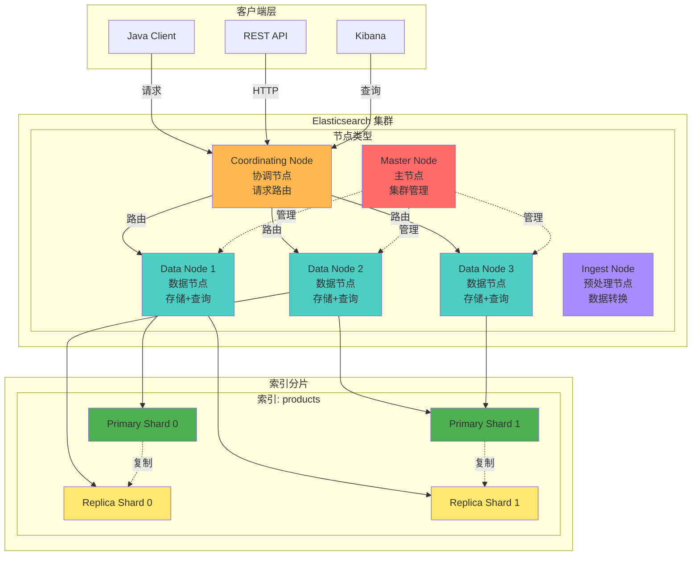

### 2. ES 核心概念映射
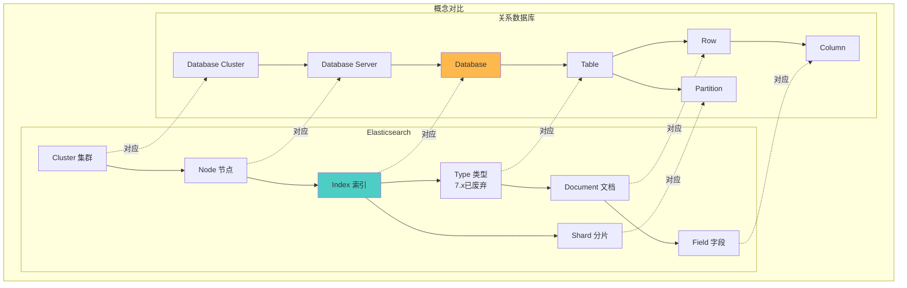

### 3. 倒排索引原理
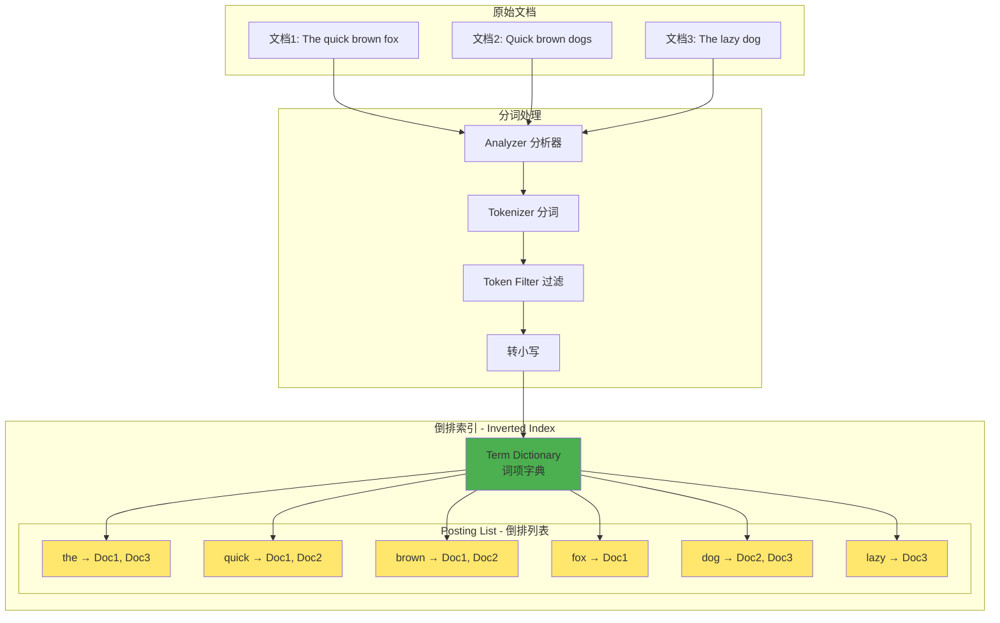

## 数据写入流程

### 1. 写入流程详解
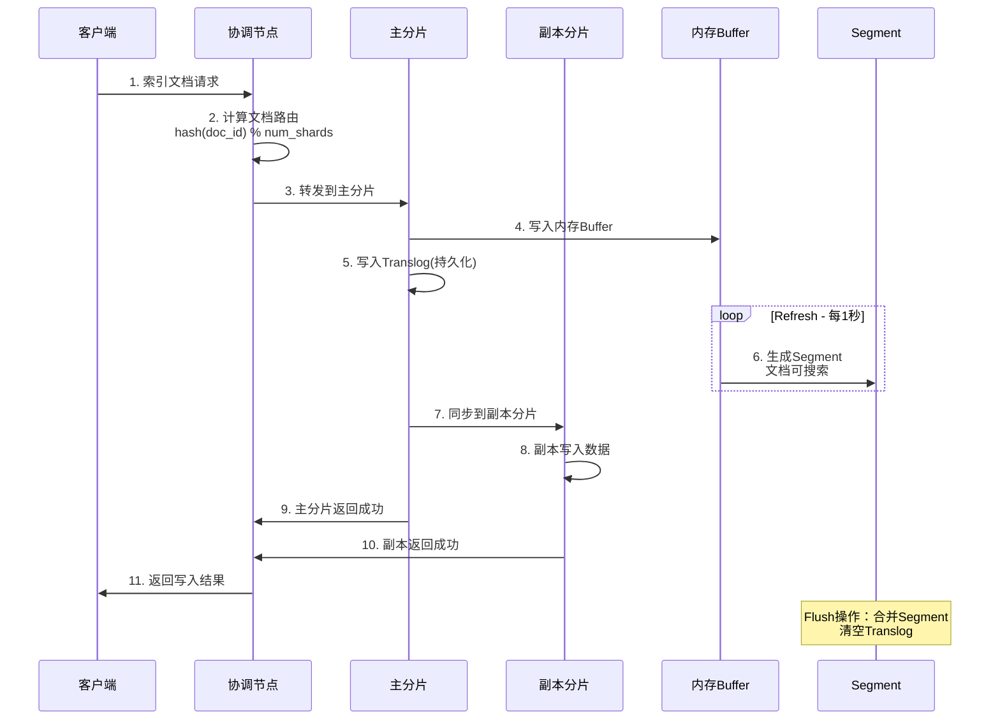

### 2. Refresh 和 Flush 机制
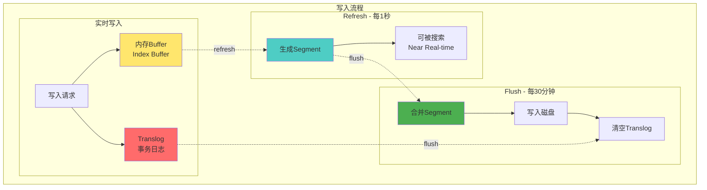

## 数据查询流程

### 1. 查询流程 - Query Then Fetch
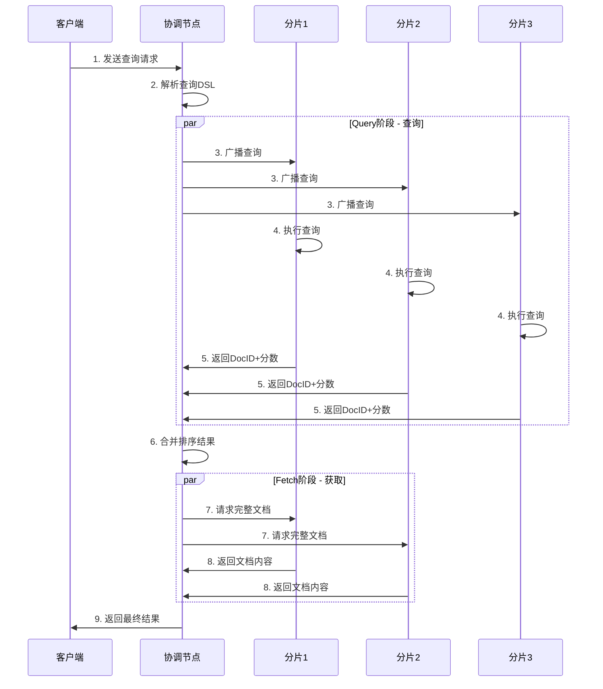

### 2. 聚合查询流程
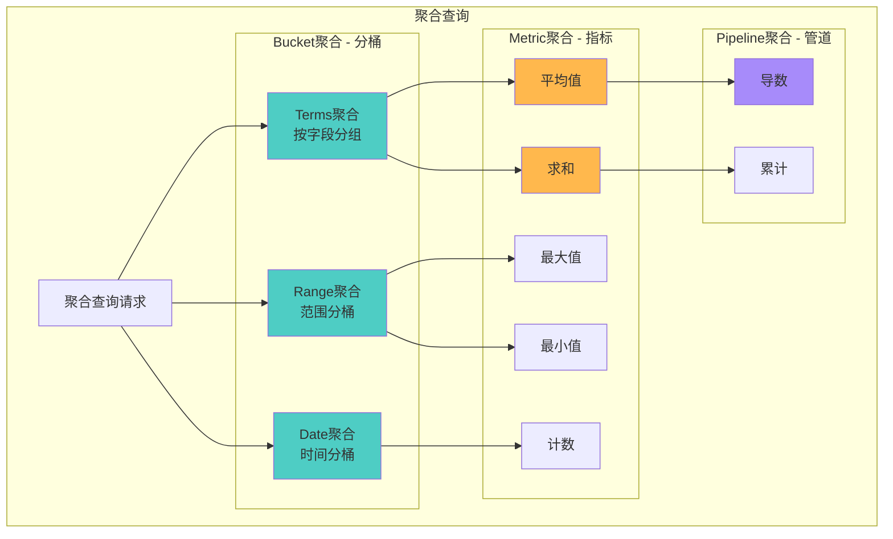

## 索引设计与优化

### 1. Mapping 映射设计
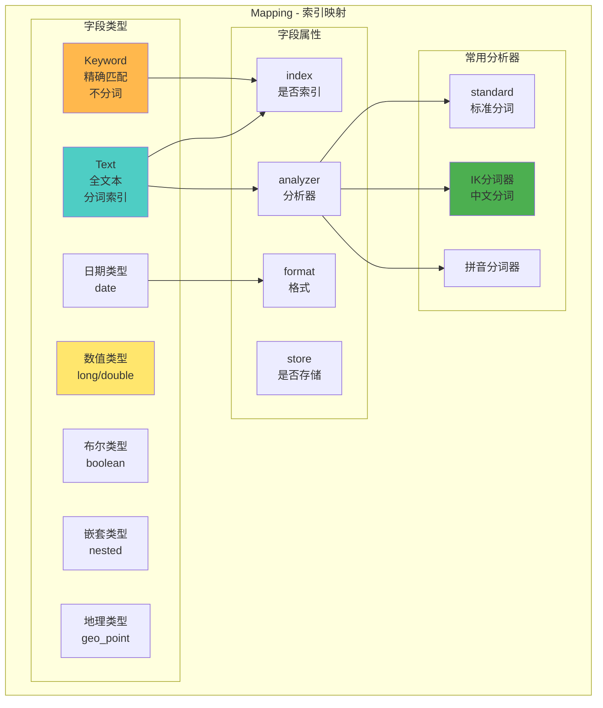

### 2. 索引别名与模板
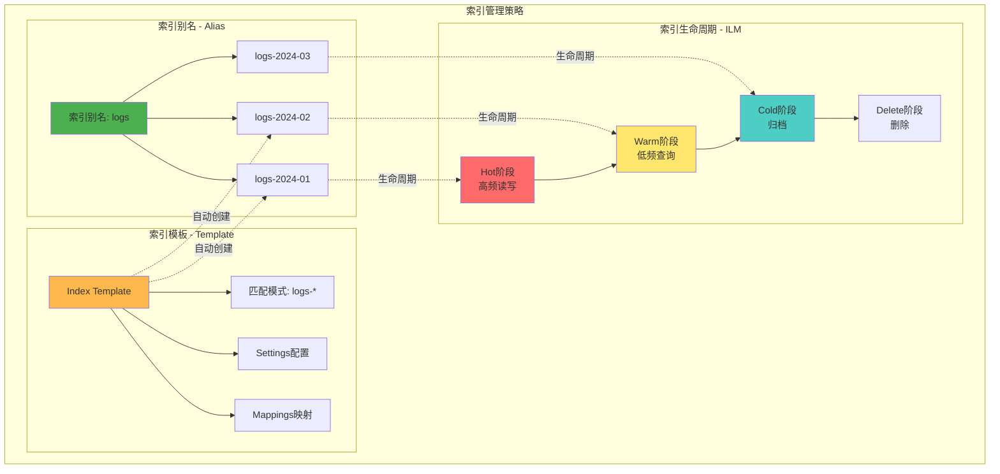

## 典型应用场景

### 1. ELK 日志分析架构
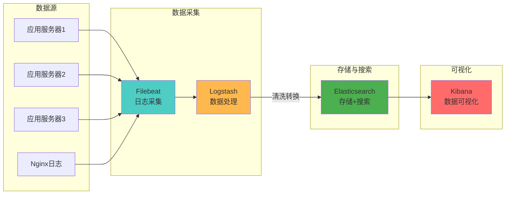

### 2. 电商搜索架构
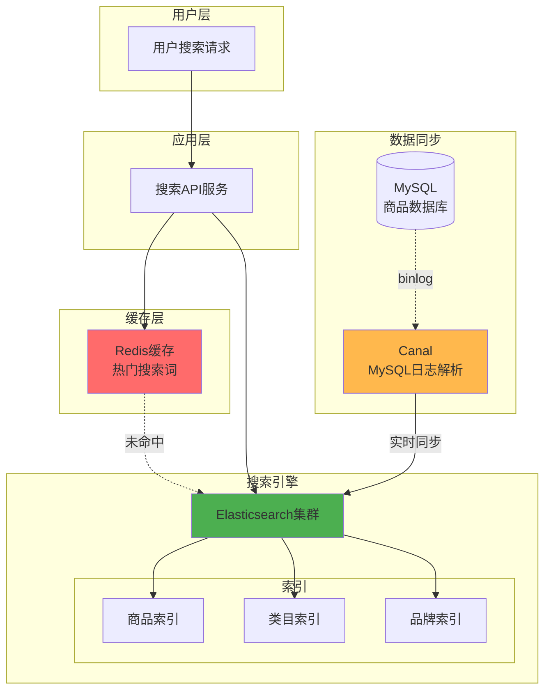

### 3. 全文搜索优化
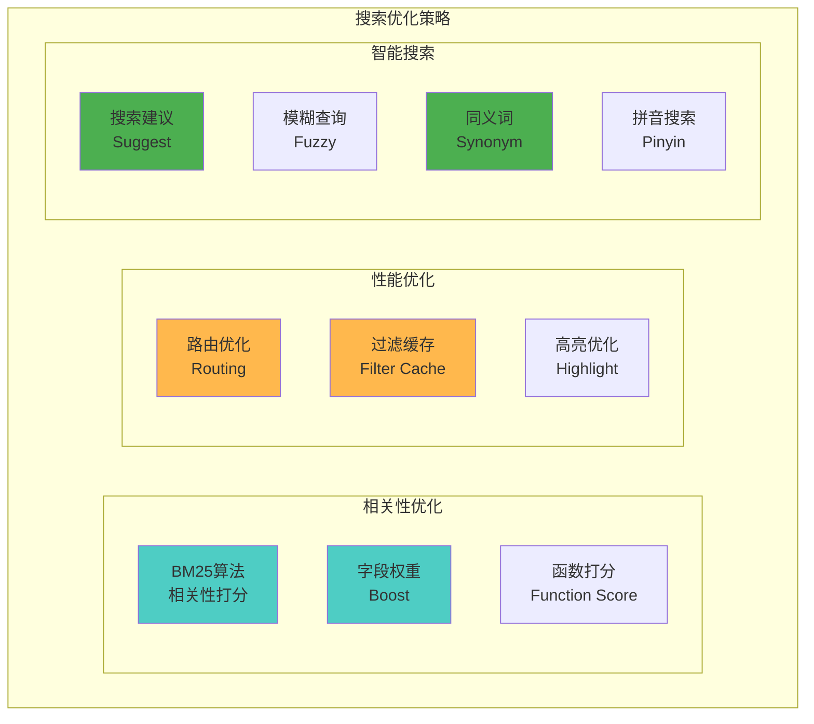

## 集群管理与监控

### 1. 集群健康状态
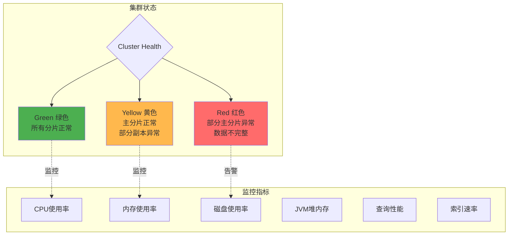

## 最佳实践建议

### 1. 分片设计
- ✅ 单分片大小控制在 20-50GB
- ✅ 节点数 ≈ 主分片数
- ✅ 副本数至少为1（高可用）
- ❌ 避免过多小分片（overhead大）
- ❌ 避免单分片过大（影响恢复速度）

### 2. 性能优化
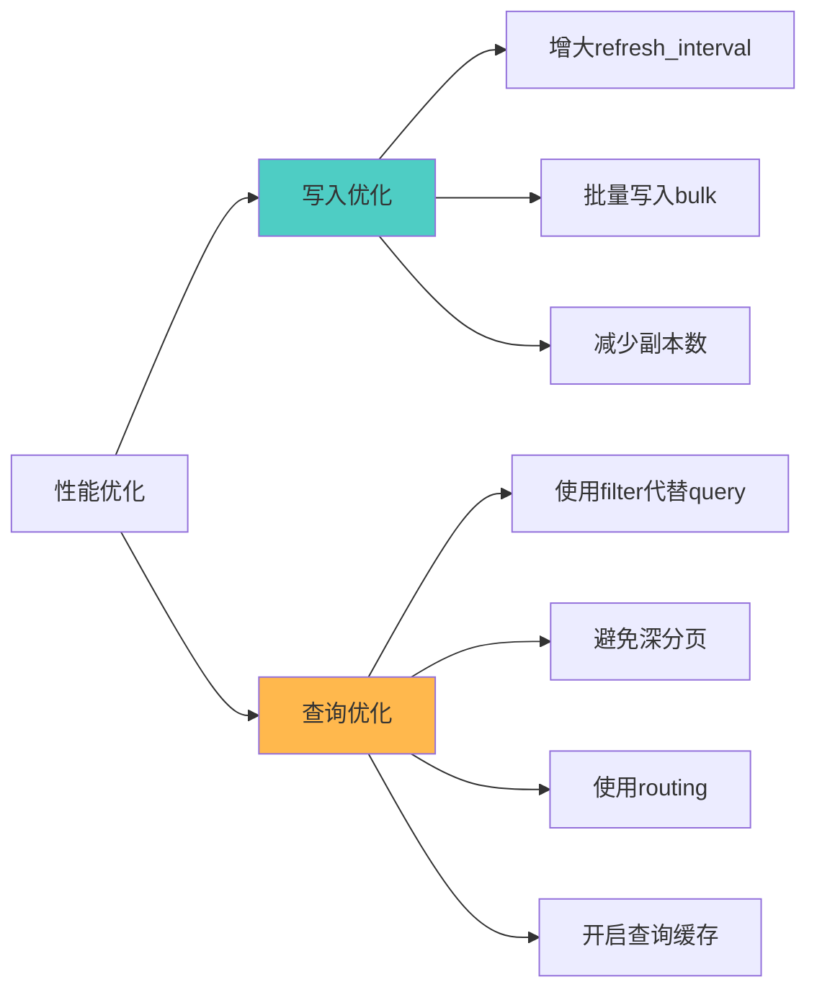

### 3. 数据建模
- 使用 keyword 类型用于精确匹配和聚合
- 使用 text 类型用于全文搜索
- 合理使用 nested 和 parent-child
- 避免过深的嵌套结构
- 冗余设计，避免 join

### 4. 容量规划
- 预估数据量和增长速度
- 计算所需存储空间（考虑副本）
- 预留30%的磁盘空间
- 规划索引生命周期管理
- 定期清理过期数据

### 5. 安全加固
- 启用 X-Pack 安全认证
- 配置 SSL/TLS 加密
- 使用角色权限控制
- 审计日志记录
- 定期备份快照
