# 分布式锁架构

## 分布式锁概述

### 1. 分布式锁应用场景
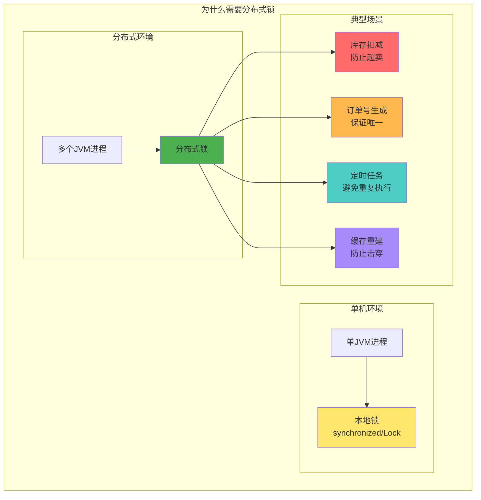

### 2. 分布式锁的特性要求
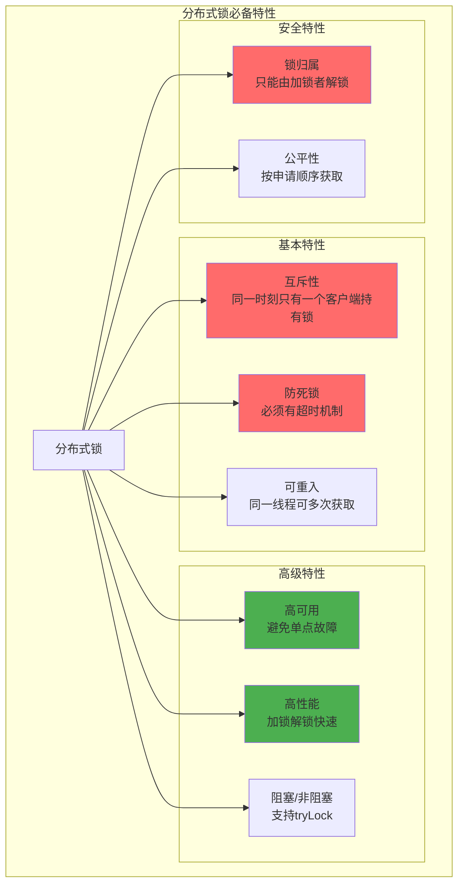

## Redisson 分布式锁

### 1. Redisson 整体架构
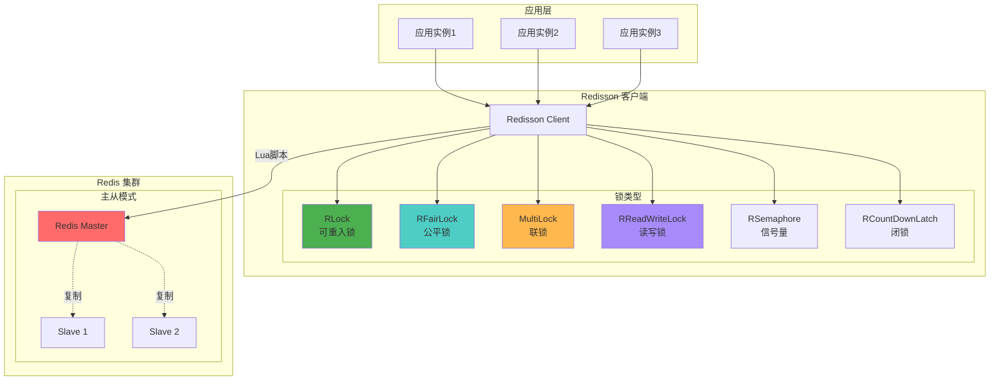

### 2. Redisson 可重入锁原理
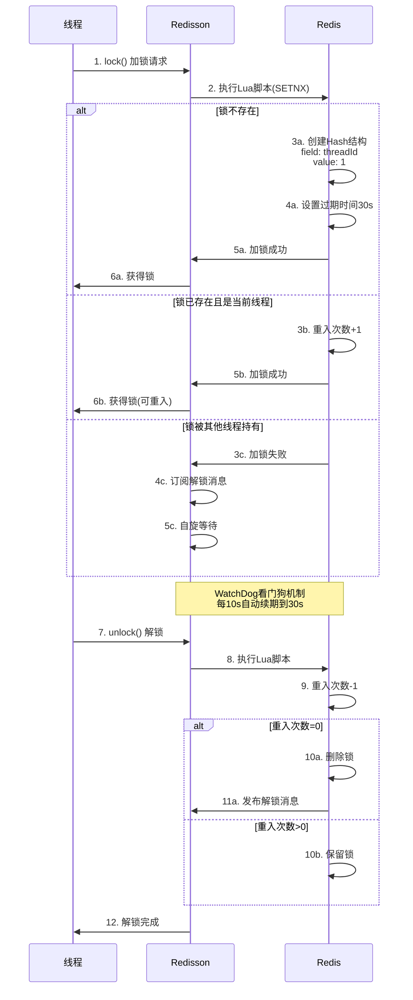

### 3. Redisson 数据结构
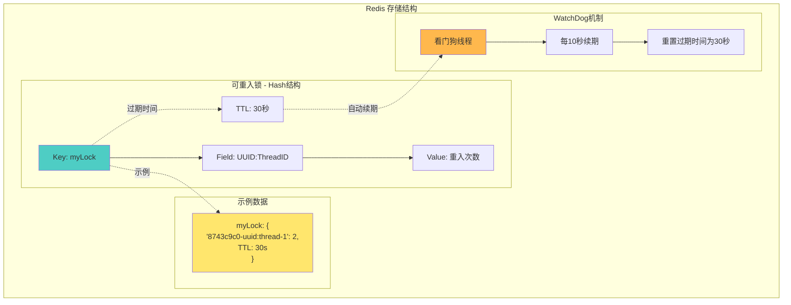

### 4. RedLock 算法（多节点）
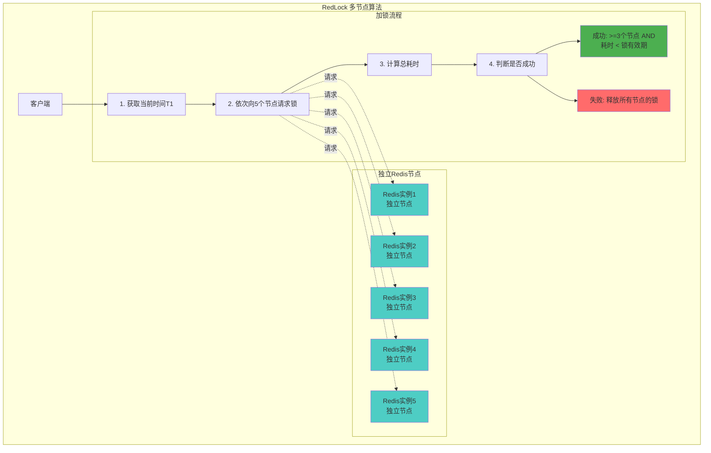

## Zookeeper 分布式锁

### 1. Zookeeper 锁架构
```mermaid
graph TB
    subgraph "应用层"
        APP1[应用1]
        APP2[应用2]
        APP3[应用3]
    end

    subgraph "Zookeeper 集群"
        LEADER[ZK Leader]
        FOLLOWER1[ZK Follower]
        FOLLOWER2[ZK Follower]

        LEADER <-.同步.-> FOLLOWER1
        LEADER <-.同步.-> FOLLOWER2
    end

    subgraph "ZNode 树结构"
        LOCKS[/locks<br/>持久节点]

        subgraph "锁节点 - 临时顺序节点"
            NODE1[/lock-0000000001<br/>应用1持有]
            NODE2[/lock-0000000002<br/>应用2等待]
            NODE3[/lock-0000000003<br/>应用3等待]
        end

        LOCKS --> NODE1
        LOCKS --> NODE2
        LOCKS --> NODE3
    end

    APP1 -->|创建节点| LEADER
    APP2 -->|创建节点| LEADER
    APP3 -->|创建节点| LEADER

    LEADER --> LOCKS

    APP2 -.watch.-> NODE1
    APP3 -.watch.-> NODE2

    style NODE1 fill:#4CAF50
    style NODE2 fill:#FFE66D
    style NODE3 fill:#FFE66D
    style LEADER fill:#FF6B6B
```

### 2. Zookeeper 加锁流程
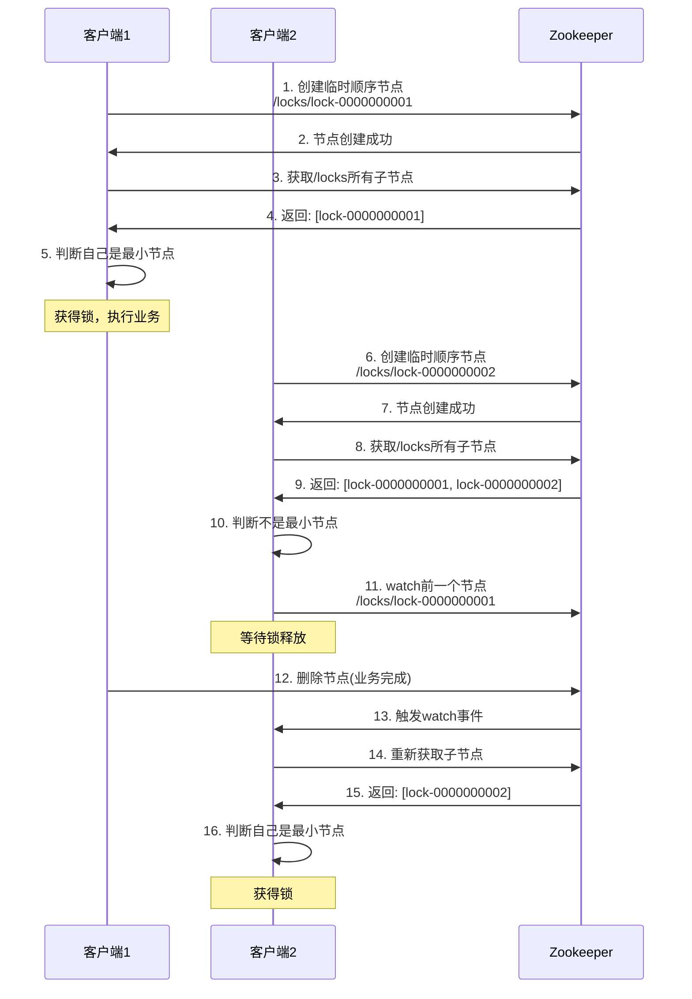

### 3. Zookeeper 锁特性
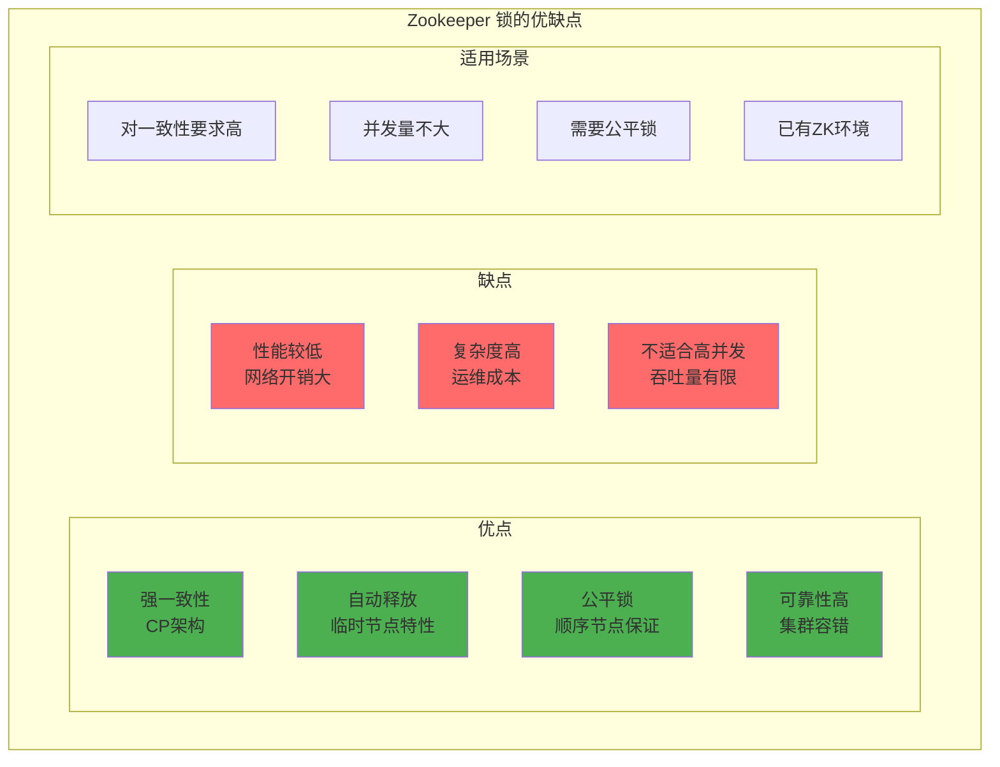

## 数据库分布式锁

### 1. 基于数据库的悲观锁
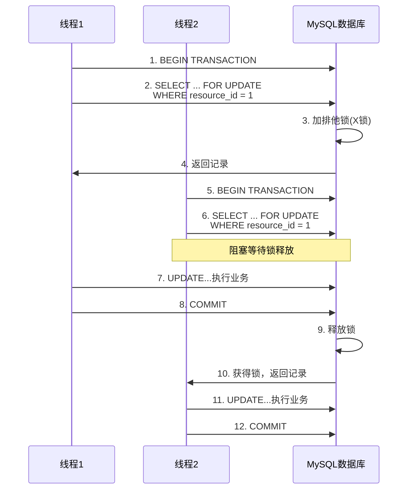

### 2. 基于数据库的乐观锁
```mermaid
graph TB
    subgraph "乐观锁 - 版本号机制"
        subgraph "表结构"
            TABLE["distributed_lock表<br/>id | resource_name | version"]
            INIT[初始: 1 | stock-001 | 0]
            TABLE --> INIT
        end

        subgraph "更新流程"
            STEP1[1. 查询: SELECT version<br/>WHERE resource = 'stock-001']
            STEP2[2. 业务处理]
            STEP3[3. 更新: UPDATE ... <br/>SET version = version + 1<br/>WHERE version = 旧version]
            STEP4{影响行数?}
            SUCCESS[= 1: 更新成功]
            FAIL[= 0: 版本冲突，重试]

            STEP1 --> STEP2 --> STEP3 --> STEP4
            STEP4 --> SUCCESS
            STEP4 --> FAIL
            FAIL -.重试.-> STEP1
        end
    end

    style SUCCESS fill:#4CAF50
    style FAIL fill:#FF6B6B
    style TABLE fill:#4ECDC4
```

## 分布式锁对比分析

### 1. 三种实现方式对比
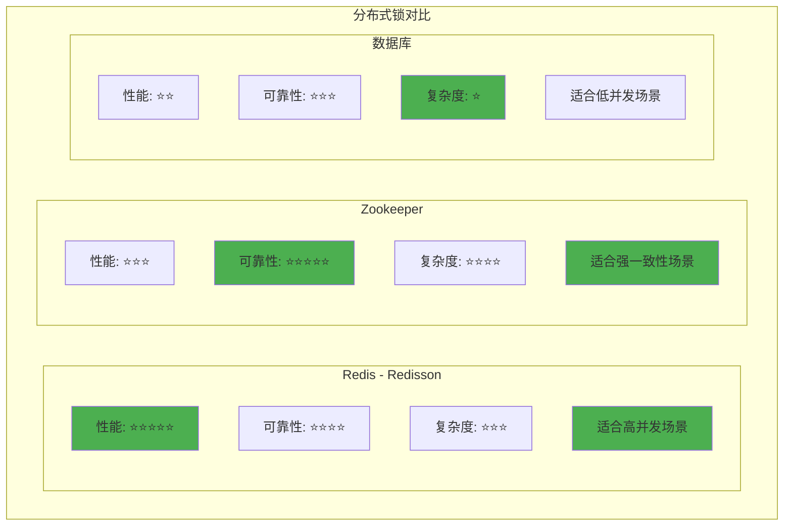

### 2. CAP 理论视角
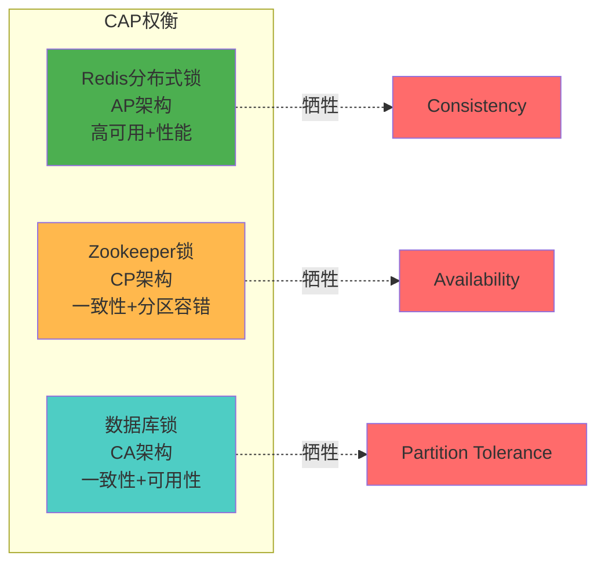

## 典型应用场景

### 1. 库存扣减防超卖
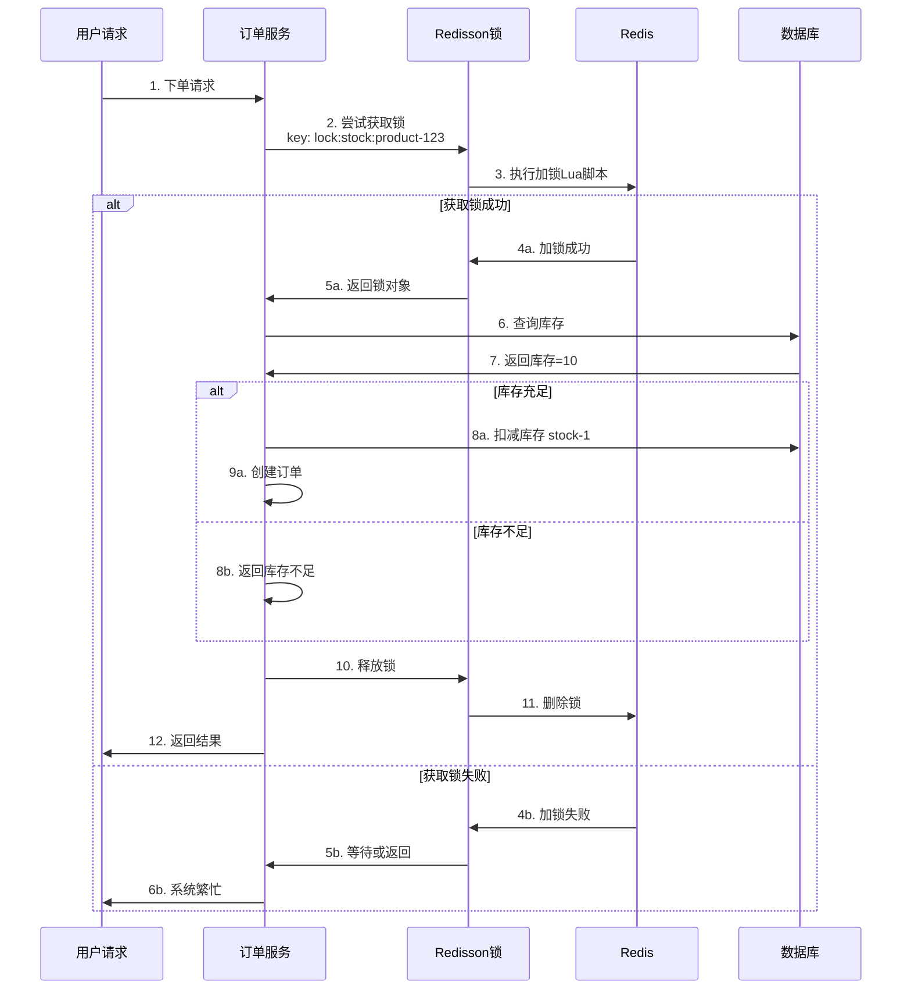

### 2. 定时任务防重复执行
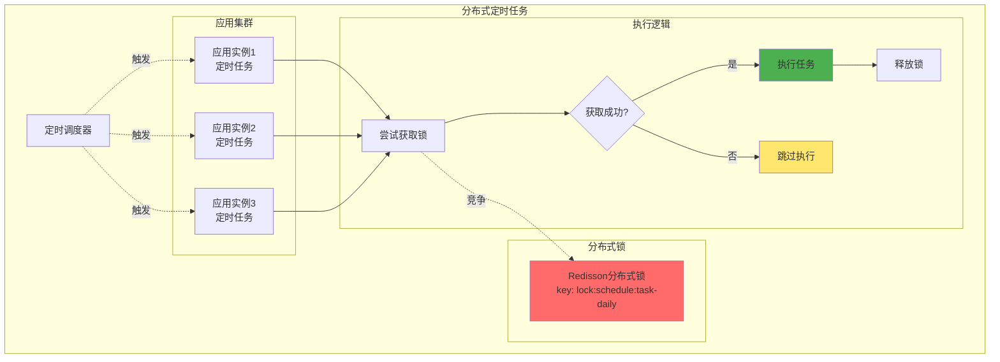

### 3. 缓存重建防击穿
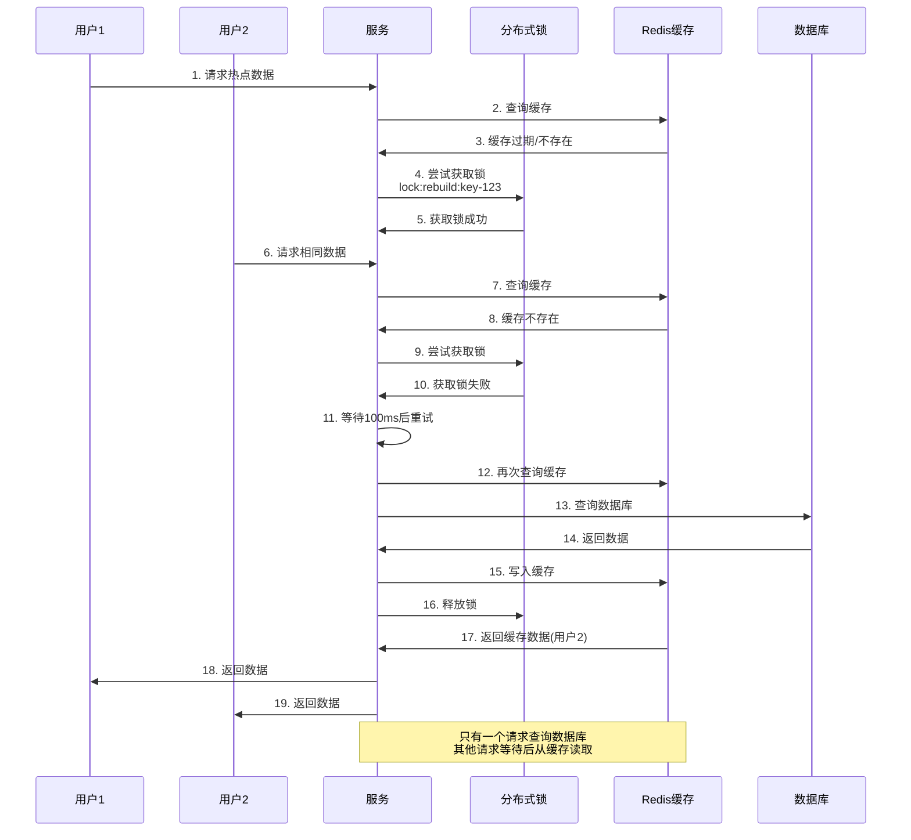

## 最佳实践建议

### 1. 选型建议

| 场景 | 推荐方案 | 理由 |
|------|---------|------|
| 高并发秒杀 | Redis + Redisson | 性能高，支持高并发 |
| 金融交易 | Zookeeper | 强一致性保证 |
| 定时任务 | Redis + Redisson | 简单高效 |
| 配置变更 | Zookeeper | 可靠性高 |
| 低并发场景 | 数据库乐观锁 | 实现简单 |

### 2. Redisson 最佳实践

```java
// 1. 设置合理的锁超时时间
RLock lock = redisson.getLock("myLock");
lock.lock(30, TimeUnit.SECONDS); // 明确超时时间

// 2. 使用 tryLock 避免无限等待
boolean locked = lock.tryLock(5, 30, TimeUnit.SECONDS);

// 3. 确保锁一定会被释放
try {
    // 业务逻辑
} finally {
    if (lock.isHeldByCurrentThread()) {
        lock.unlock();
    }
}

// 4. 使用 MultiLock 实现更可靠的锁
RLock lock1 = redisson.getLock("lock1");
RLock lock2 = redisson.getLock("lock2");
RedissonMultiLock multiLock = new RedissonMultiLock(lock1, lock2);
```

### 3. 常见问题与解决方案

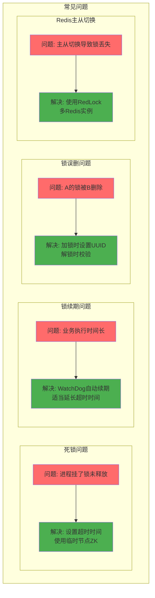

### 4. 性能优化建议

- 减少锁粒度：细化锁的范围
- 使用分段锁：将资源分段，降低竞争
- 读写分离：使用读写锁
- 降级方案：锁获取失败时的兜底策略
- 监控告警：锁等待时间、持有时间

### 5. 安全性建议

- 避免长时间持有锁
- 设置合理的超时时间
- 实现锁的可重入性
- 防止死锁（超时机制）
- 记录锁的持有者和操作日志
