# 分布式任务调度中间件 - XXL-Job

## XXL-Job 整体架构

### 1. XXL-Job 系统架构
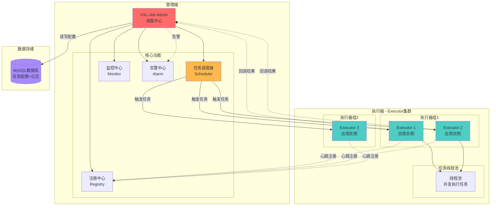
```mermaid
graph TB
    subgraph "管理端"
        ADMIN[XXL-Job Admin<br/>调度中心]

        subgraph "核心功能"
            SCHEDULER[任务调度器<br/>Scheduler]
            REGISTRY[注册中心<br/>Registry]
            MONITOR[监控中心<br/>Monitor]
            ALARM[告警中心<br/>Alarm]
        end

        ADMIN --> SCHEDULER
        ADMIN --> REGISTRY
        ADMIN --> MONITOR
        ADMIN --> ALARM
    end

    subgraph "数据存储"
        MYSQL[(MySQL数据库<br/>任务配置+日志)]
    end

    subgraph "执行端 - Executor集群"
        subgraph "执行器组1"
            EXEC1[Executor 1<br/>应用实例]
            EXEC2[Executor 2<br/>应用实例]
        end

        subgraph "执行器组2"
            EXEC3[Executor 3<br/>应用实例]
        end

        subgraph "任务线程池"
            THREAD[线程池<br/>并发执行任务]
        end
    end

    ADMIN -->|读写配置| MYSQL
    SCHEDULER -->|触发任务| EXEC1
    SCHEDULER -->|触发任务| EXEC2
    SCHEDULER -->|触发任务| EXEC3

    EXEC1 -.心跳注册.-> REGISTRY
    EXEC2 -.心跳注册.-> REGISTRY
    EXEC3 -.心跳注册.-> REGISTRY

    EXEC1 --> THREAD
    EXEC2 --> THREAD

    EXEC1 -.回调结果.-> ADMIN
    EXEC2 -.回调结果.-> ADMIN

    ADMIN -.告警.-> ALARM

    style ADMIN fill:#FF6B6B
    style SCHEDULER fill:#FFB84D
    style EXEC1 fill:#4ECDC4
    style EXEC2 fill:#4ECDC4
    style EXEC3 fill:#4ECDC4
    style MYSQL fill:#A78BFA
```

### 2. XXL-Job 核心组件
```mermaid
graph TB
    subgraph "XXL-Job 核心组件"
        subgraph "调度中心 Admin"
            A1[任务管理<br/>CRUD操作]
            A2[调度器<br/>时间轮算法]
            A3[执行器管理<br/>注册发现]
            A4[日志管理<br/>执行记录]
            A5[报表统计<br/>任务分析]
        end

        subgraph "执行器 Executor"
            E1[任务注册<br/>@XxlJob注解]
            E2[心跳上报<br/>30秒/次]
            E3[任务执行<br/>线程池]
            E4[日志回传<br/>异步回调]
            E5[任务终止<br/>interrupt]
        end

        subgraph "通信协议"
            C1[HTTP通信]
            C2[JSON序列化]
            C3[AccessToken鉴权]
        end
    end

    A2 --> C1
    C1 --> E3

    E2 --> C1
    C1 --> A3

    E4 --> C1
    C1 --> A4

    style A1 fill:#FFE66D
    style A2 fill:#FF6B6B
    style E3 fill:#4ECDC4
    style C1 fill:#FFB84D
```

## 任务调度流程

### 1. 任务调度全流程
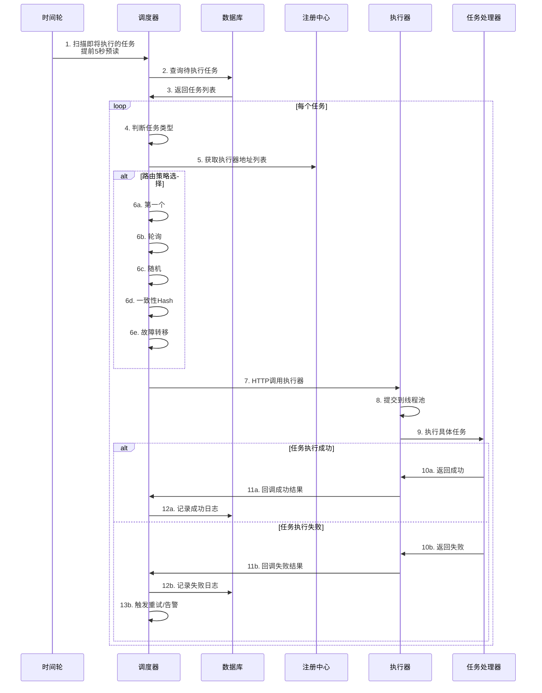
```mermaid
sequenceDiagram
    participant Timer as 时间轮
    participant Scheduler as 调度器
    participant DB as 数据库
    participant Registry as 注册中心
    participant Executor as 执行器
    participant JobHandler as 任务处理器

    Timer->>Scheduler: 1. 扫描即将执行的任务<br/>提前5秒预读
    Scheduler->>DB: 2. 查询待执行任务
    DB->>Scheduler: 3. 返回任务列表

    loop 每个任务
        Scheduler->>Scheduler: 4. 判断任务类型
        Scheduler->>Registry: 5. 获取执行器地址列表

        alt 路由策略选择
            Scheduler->>Scheduler: 6a. 第一个
            Scheduler->>Scheduler: 6b. 轮询
            Scheduler->>Scheduler: 6c. 随机
            Scheduler->>Scheduler: 6d. 一致性Hash
            Scheduler->>Scheduler: 6e. 故障转移
        end

        Scheduler->>Executor: 7. HTTP调用执行器
        Executor->>Executor: 8. 提交到线程池
        Executor->>JobHandler: 9. 执行具体任务

        alt 任务执行成功
            JobHandler->>Executor: 10a. 返回成功
            Executor->>Scheduler: 11a. 回调成功结果
            Scheduler->>DB: 12a. 记录成功日志
        else 任务执行失败
            JobHandler->>Executor: 10b. 返回失败
            Executor->>Scheduler: 11b. 回调失败结果
            Scheduler->>DB: 12b. 记录失败日志
            Scheduler->>Scheduler: 13b. 触发重试/告警
        end
    end
```

### 2. 时间轮调度算法
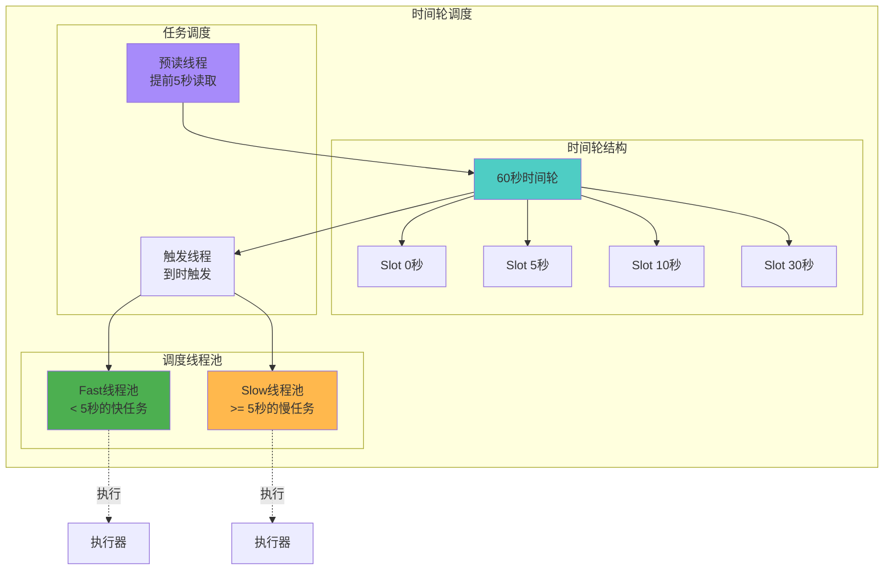
```mermaid
graph TB
    subgraph "时间轮调度"
        subgraph "调度线程池"
            FAST[Fast线程池<br/>< 5秒的快任务]
            SLOW[Slow线程池<br/>>= 5秒的慢任务]
        end

        subgraph "时间轮结构"
            RING[60秒时间轮]
            SLOT0[Slot 0秒]
            SLOT5[Slot 5秒]
            SLOT10[Slot 10秒]
            SLOT30[Slot 30秒]

            RING --> SLOT0
            RING --> SLOT5
            RING --> SLOT10
            RING --> SLOT30
        end

        subgraph "任务调度"
            PRE_READ[预读线程<br/>提前5秒读取]
            TRIGGER[触发线程<br/>到时触发]

            PRE_READ --> RING
            RING --> TRIGGER
        end
    end

    TRIGGER --> FAST
    TRIGGER --> SLOW

    FAST -.执行.-> EXECUTOR1[执行器]
    SLOW -.执行.-> EXECUTOR2[执行器]

    style FAST fill:#4CAF50
    style SLOW fill:#FFB84D
    style RING fill:#4ECDC4
    style PRE_READ fill:#A78BFA
```

### 3. 执行器注册与心跳
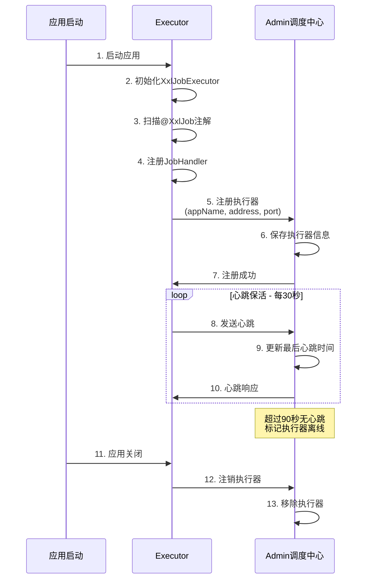
```mermaid
sequenceDiagram
    participant App as 应用启动
    participant Executor as Executor
    participant Admin as Admin调度中心

    App->>Executor: 1. 启动应用
    Executor->>Executor: 2. 初始化XxlJobExecutor
    Executor->>Executor: 3. 扫描@XxlJob注解
    Executor->>Executor: 4. 注册JobHandler

    Executor->>Admin: 5. 注册执行器<br/>(appName, address, port)
    Admin->>Admin: 6. 保存执行器信息
    Admin->>Executor: 7. 注册成功

    loop 心跳保活 - 每30秒
        Executor->>Admin: 8. 发送心跳
        Admin->>Admin: 9. 更新最后心跳时间
        Admin->>Executor: 10. 心跳响应
    end

    Note over Admin: 超过90秒无心跳<br/>标记执行器离线

    App->>Executor: 11. 应用关闭
    Executor->>Admin: 12. 注销执行器
    Admin->>Admin: 13. 移除执行器
```

## 任务路由策略

### 1. 路由策略详解
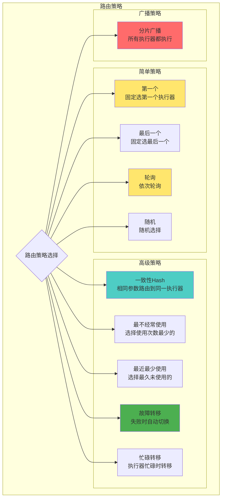
```mermaid
graph TB
    subgraph "路由策略"
        ROUTER{路由策略选择}

        subgraph "简单策略"
            FIRST[第一个<br/>固定选第一个执行器]
            LAST[最后一个<br/>固定选最后一个]
            ROUND[轮询<br/>依次轮询]
            RANDOM[随机<br/>随机选择]
        end

        subgraph "高级策略"
            HASH[一致性Hash<br/>相同参数路由到同一执行器]
            LFU[最不经常使用<br/>选择使用次数最少的]
            LRU[最近最少使用<br/>选择最久未使用的]
            FAILOVER[故障转移<br/>失败时自动切换]
            BUSY_OVER[忙碌转移<br/>执行器忙碌时转移]
        end

        subgraph "广播策略"
            BROADCAST[分片广播<br/>所有执行器都执行]
        end
    end

    ROUTER --> FIRST
    ROUTER --> LAST
    ROUTER --> ROUND
    ROUTER --> RANDOM
    ROUTER --> HASH
    ROUTER --> LFU
    ROUTER --> LRU
    ROUTER --> FAILOVER
    ROUTER --> BUSY_OVER
    ROUTER --> BROADCAST

    style FIRST fill:#FFE66D
    style ROUND fill:#FFE66D
    style HASH fill:#4ECDC4
    style FAILOVER fill:#4CAF50
    style BROADCAST fill:#FF6B6B
```

### 2. 分片广播机制
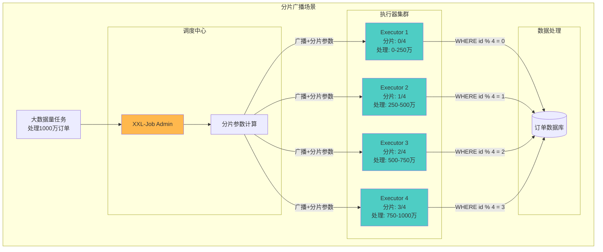
```mermaid
graph TB
    subgraph "分片广播场景"
        TASK[大数据量任务<br/>处理1000万订单]

        subgraph "调度中心"
            ADMIN[XXL-Job Admin]
            SHARD[分片参数计算]
        end

        subgraph "执行器集群"
            EXEC1[Executor 1<br/>分片: 0/4<br/>处理: 0-250万]
            EXEC2[Executor 2<br/>分片: 1/4<br/>处理: 250-500万]
            EXEC3[Executor 3<br/>分片: 2/4<br/>处理: 500-750万]
            EXEC4[Executor 4<br/>分片: 3/4<br/>处理: 750-1000万]
        end

        subgraph "数据处理"
            DB[(订单数据库)]
        end
    end

    TASK --> ADMIN
    ADMIN --> SHARD

    SHARD -->|广播+分片参数| EXEC1
    SHARD -->|广播+分片参数| EXEC2
    SHARD -->|广播+分片参数| EXEC3
    SHARD -->|广播+分片参数| EXEC4

    EXEC1 -->|WHERE id % 4 = 0| DB
    EXEC2 -->|WHERE id % 4 = 1| DB
    EXEC3 -->|WHERE id % 4 = 2| DB
    EXEC4 -->|WHERE id % 4 = 3| DB

    style ADMIN fill:#FFB84D
    style EXEC1 fill:#4ECDC4
    style EXEC2 fill:#4ECDC4
    style EXEC3 fill:#4ECDC4
    style EXEC4 fill:#4ECDC4
```

## 调度模式与阻塞策略

### 1. 调度过期策略
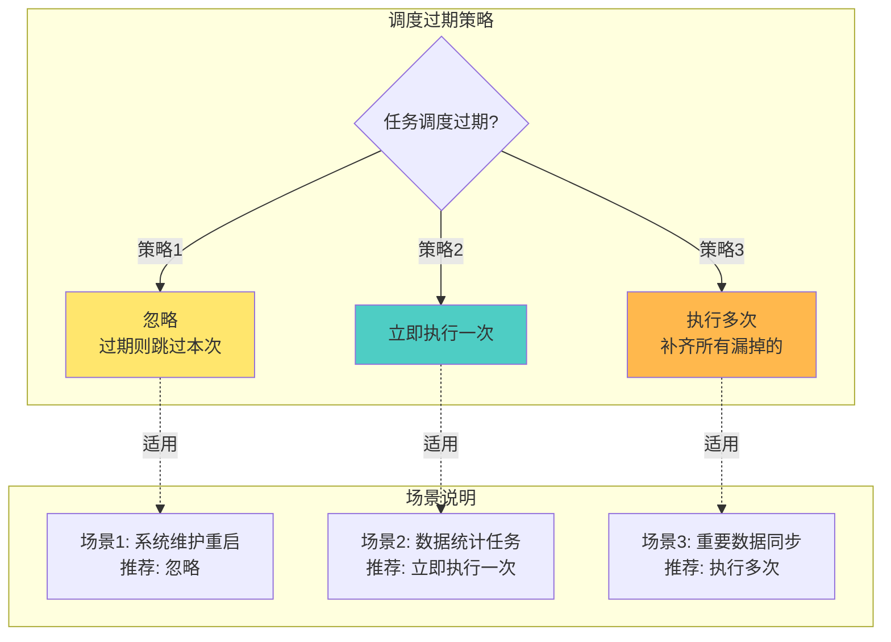
```mermaid
graph TB
    subgraph "调度过期策略"
        EXPIRE{任务调度过期?}

        IGNORE[忽略<br/>过期则跳过本次]
        IMMEDIATELY[立即执行一次]
        MULTI[执行多次<br/>补齐所有漏掉的]

        EXPIRE -->|策略1| IGNORE
        EXPIRE -->|策略2| IMMEDIATELY
        EXPIRE -->|策略3| MULTI
    end

    subgraph "场景说明"
        S1[场景1: 系统维护重启<br/>推荐: 忽略]
        S2[场景2: 数据统计任务<br/>推荐: 立即执行一次]
        S3[场景3: 重要数据同步<br/>推荐: 执行多次]
    end

    IGNORE -.适用.-> S1
    IMMEDIATELY -.适用.-> S2
    MULTI -.适用.-> S3

    style IGNORE fill:#FFE66D
    style IMMEDIATELY fill:#4ECDC4
    style MULTI fill:#FFB84D
```

### 2. 阻塞处理策略
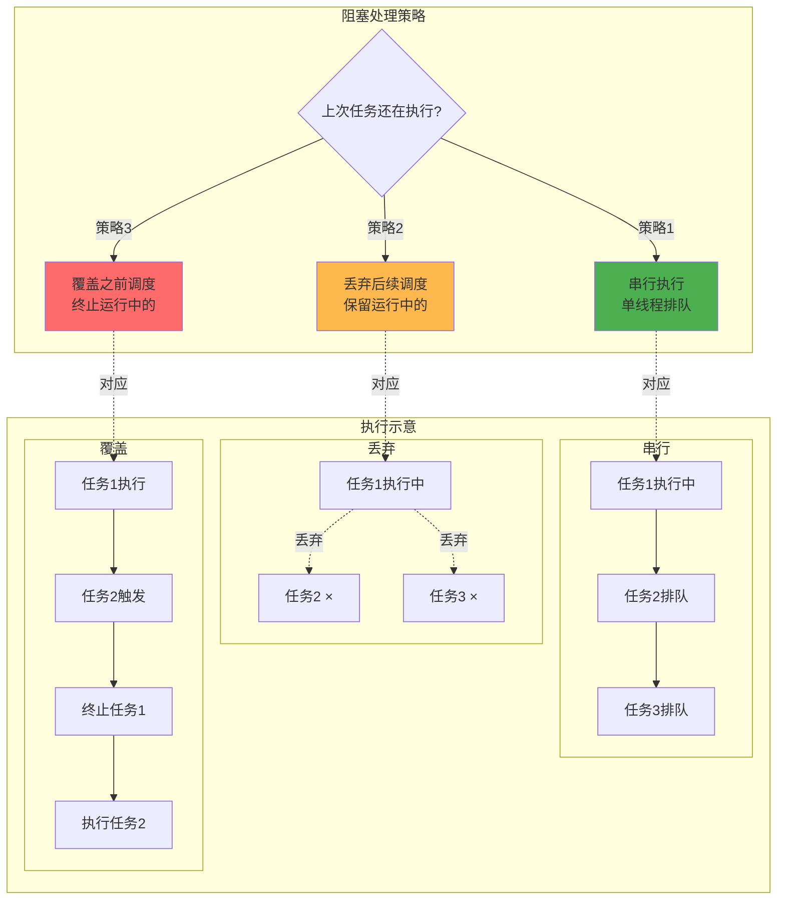
```mermaid
graph TB
    subgraph "阻塞处理策略"
        BLOCK{上次任务还在执行?}

        SERIAL[串行执行<br/>单线程排队]
        DISCARD[丢弃后续调度<br/>保留运行中的]
        COVER[覆盖之前调度<br/>终止运行中的]

        BLOCK -->|策略1| SERIAL
        BLOCK -->|策略2| DISCARD
        BLOCK -->|策略3| COVER
    end

    subgraph "执行示意"
        subgraph "串行"
            T1[任务1执行中] --> T2[任务2排队] --> T3[任务3排队]
        end

        subgraph "丢弃"
            T4[任务1执行中]
            T5[任务2 ×]
            T6[任务3 ×]

            T4 -.丢弃.-> T5
            T4 -.丢弃.-> T6
        end

        subgraph "覆盖"
            T7[任务1执行]
            T8[任务2触发]
            T9[终止任务1]
            T10[执行任务2]

            T7 --> T8 --> T9 --> T10
        end
    end

    SERIAL -.对应.-> T1
    DISCARD -.对应.-> T4
    COVER -.对应.-> T7

    style SERIAL fill:#4CAF50
    style DISCARD fill:#FFB84D
    style COVER fill:#FF6B6B
```

## 任务执行与监控

### 1. 任务执行日志
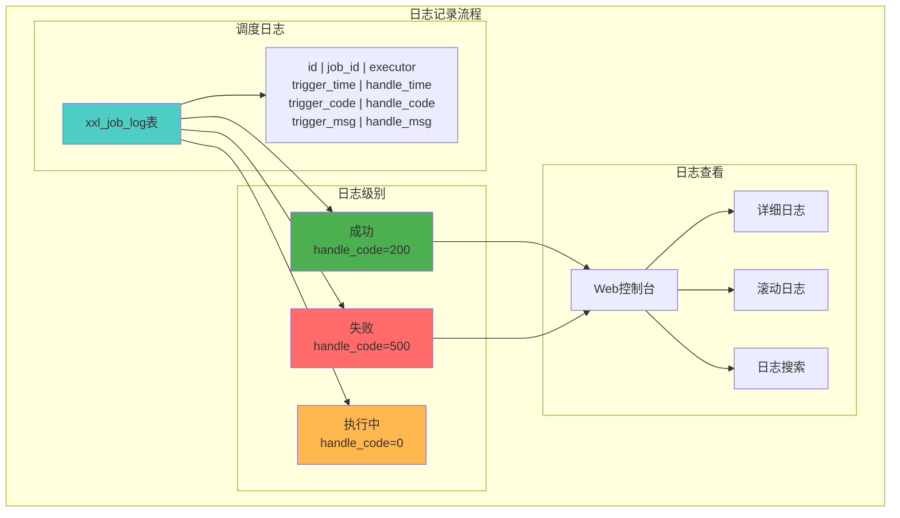
```mermaid
graph TB
    subgraph "日志记录流程"
        subgraph "调度日志"
            SCHEDULE_LOG[xxl_job_log表]
            LOG_FIELDS["id | job_id | executor<br/>trigger_time | handle_time<br/>trigger_code | handle_code<br/>trigger_msg | handle_msg"]

            SCHEDULE_LOG --> LOG_FIELDS
        end

        subgraph "日志级别"
            SUCCESS[成功<br/>handle_code=200]
            FAIL[失败<br/>handle_code=500]
            RUNNING[执行中<br/>handle_code=0]
        end

        subgraph "日志查看"
            WEB[Web控制台]
            DETAIL[详细日志]
            ROLLING[滚动日志]
            SEARCH[日志搜索]

            WEB --> DETAIL
            WEB --> ROLLING
            WEB --> SEARCH
        end
    end

    SCHEDULE_LOG --> SUCCESS
    SCHEDULE_LOG --> FAIL
    SCHEDULE_LOG --> RUNNING

    SUCCESS --> WEB
    FAIL --> WEB

    style SCHEDULE_LOG fill:#4ECDC4
    style SUCCESS fill:#4CAF50
    style FAIL fill:#FF6B6B
    style RUNNING fill:#FFB84D
```

### 2. 监控告警机制
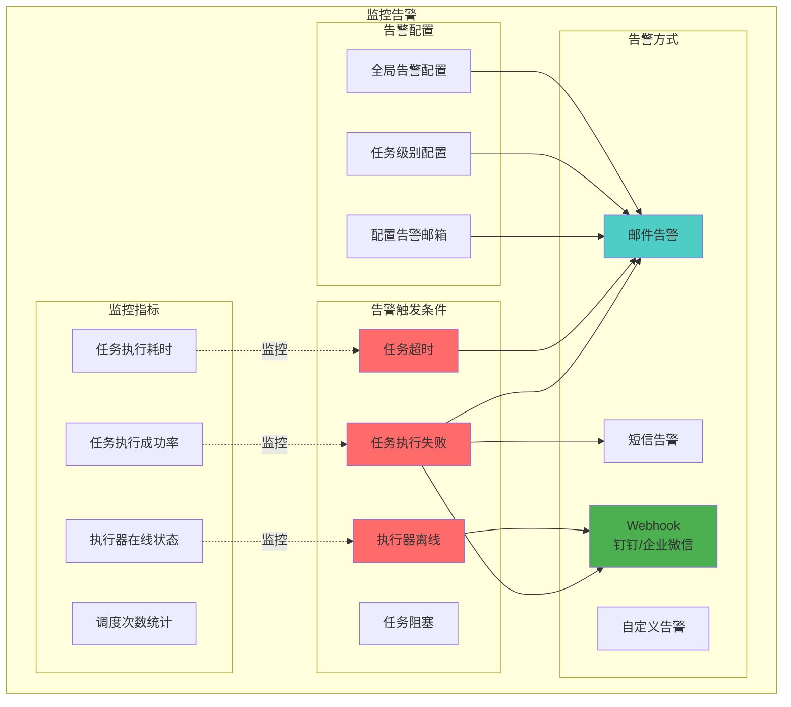
```mermaid
graph TB
    subgraph "监控告警"
        subgraph "监控指标"
            M1[任务执行成功率]
            M2[任务执行耗时]
            M3[执行器在线状态]
            M4[调度次数统计]
        end

        subgraph "告警触发条件"
            A1[任务执行失败]
            A2[任务超时]
            A3[执行器离线]
            A4[任务阻塞]
        end

        subgraph "告警方式"
            EMAIL[邮件告警]
            SMS[短信告警]
            WEBHOOK[Webhook<br/>钉钉/企业微信]
            CUSTOM[自定义告警]
        end

        subgraph "告警配置"
            ADMIN_USER[配置告警邮箱]
            JOB_CONFIG[任务级别配置]
            GLOBAL[全局告警配置]
        end
    end

    A1 --> EMAIL
    A1 --> SMS
    A1 --> WEBHOOK
    A2 --> EMAIL
    A3 --> WEBHOOK

    ADMIN_USER --> EMAIL
    JOB_CONFIG --> EMAIL
    GLOBAL --> EMAIL

    M1 -.监控.-> A1
    M2 -.监控.-> A2
    M3 -.监控.-> A3

    style A1 fill:#FF6B6B
    style A2 fill:#FF6B6B
    style A3 fill:#FF6B6B
    style EMAIL fill:#4ECDC4
    style WEBHOOK fill:#4CAF50
```

## 典型应用场景

### 1. 数据同步任务
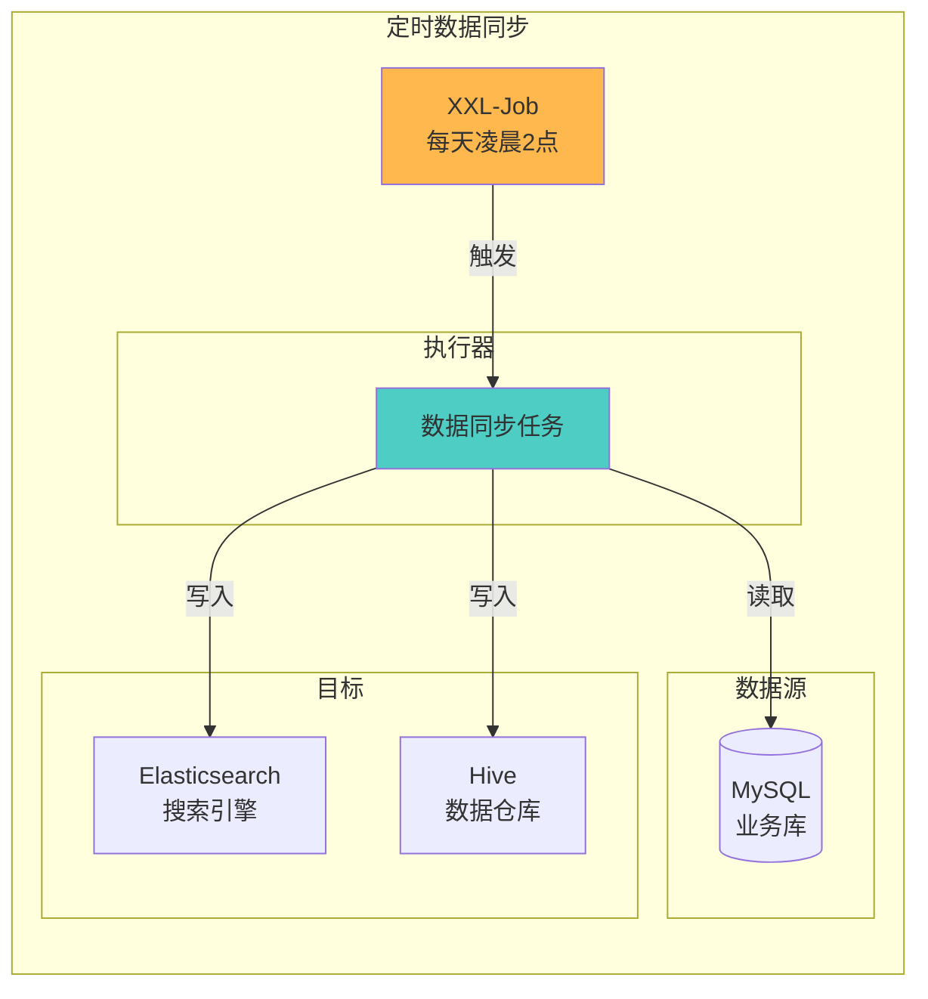
```mermaid
graph LR
    subgraph "定时数据同步"
        XXL[XXL-Job<br/>每天凌晨2点]

        subgraph "执行器"
            SYNC[数据同步任务]
        end

        subgraph "数据源"
            MYSQL[(MySQL<br/>业务库)]
        end

        subgraph "目标"
            ES[Elasticsearch<br/>搜索引擎]
            HIVE[Hive<br/>数据仓库]
        end
    end

    XXL -->|触发| SYNC
    SYNC -->|读取| MYSQL
    SYNC -->|写入| ES
    SYNC -->|写入| HIVE

    style XXL fill:#FFB84D
    style SYNC fill:#4ECDC4
```

### 2. 报表统计任务
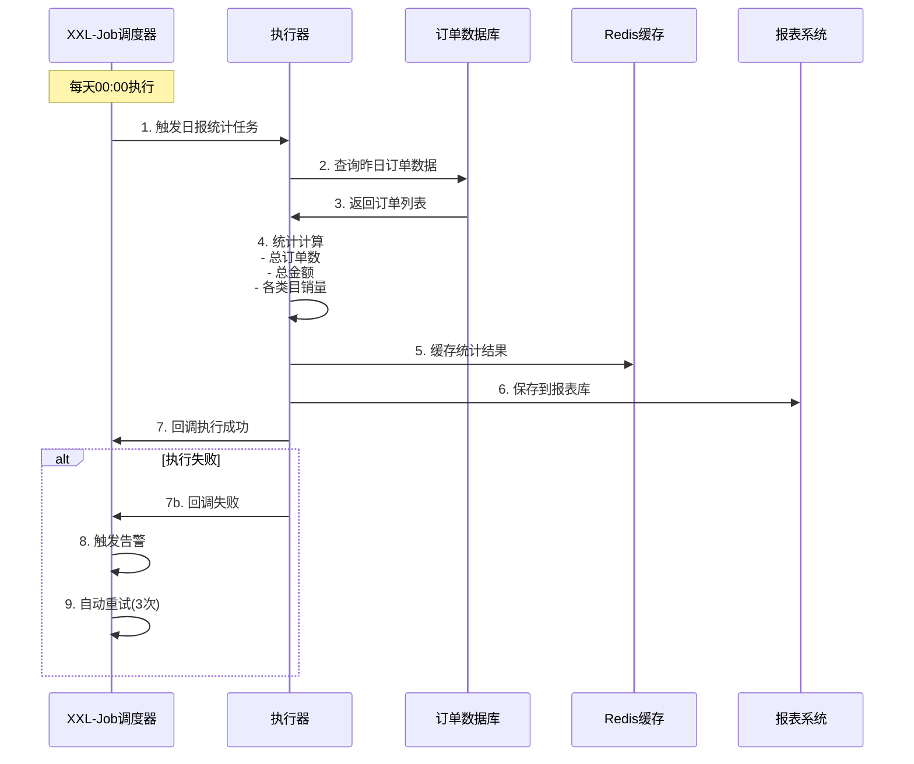
```mermaid
sequenceDiagram
    participant Scheduler as XXL-Job调度器
    participant Executor as 执行器
    participant DB as 订单数据库
    participant Redis as Redis缓存
    participant Report as 报表系统

    Note over Scheduler: 每天00:00执行

    Scheduler->>Executor: 1. 触发日报统计任务
    Executor->>DB: 2. 查询昨日订单数据
    DB->>Executor: 3. 返回订单列表

    Executor->>Executor: 4. 统计计算<br/>- 总订单数<br/>- 总金额<br/>- 各类目销量

    Executor->>Redis: 5. 缓存统计结果
    Executor->>Report: 6. 保存到报表库
    Executor->>Scheduler: 7. 回调执行成功

    alt 执行失败
        Executor->>Scheduler: 7b. 回调失败
        Scheduler->>Scheduler: 8. 触发告警
        Scheduler->>Scheduler: 9. 自动重试(3次)
    end
```

### 3. 大数据分片处理
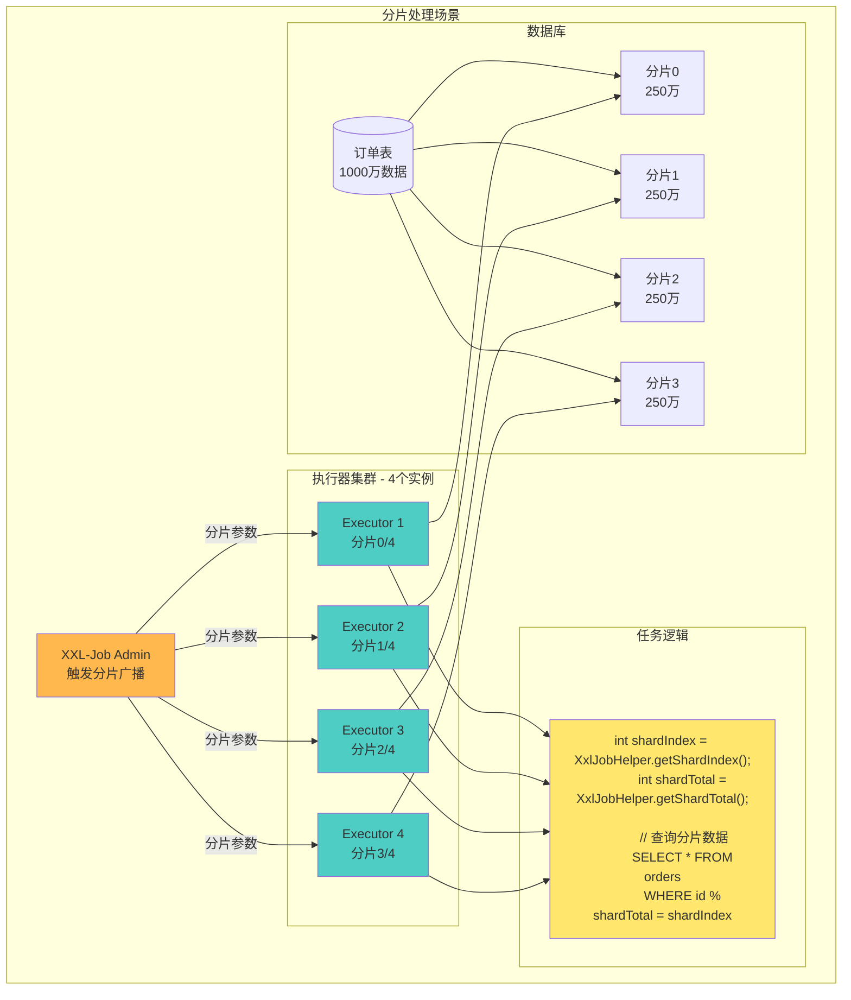
```mermaid
graph TB
    subgraph "分片处理场景"
        ADMIN[XXL-Job Admin<br/>触发分片广播]

        subgraph "执行器集群 - 4个实例"
            E1[Executor 1<br/>分片0/4]
            E2[Executor 2<br/>分片1/4]
            E3[Executor 3<br/>分片2/4]
            E4[Executor 4<br/>分片3/4]
        end

        subgraph "任务逻辑"
            CODE["
            int shardIndex = XxlJobHelper.getShardIndex();
            int shardTotal = XxlJobHelper.getShardTotal();

            // 查询分片数据
            SELECT * FROM orders
            WHERE id % shardTotal = shardIndex
            "]
        end

        subgraph "数据库"
            DB[(订单表<br/>1000万数据)]

            D1[分片0<br/>250万]
            D2[分片1<br/>250万]
            D3[分片2<br/>250万]
            D4[分片3<br/>250万]

            DB --> D1
            DB --> D2
            DB --> D3
            DB --> D4
        end
    end

    ADMIN -->|分片参数| E1
    ADMIN -->|分片参数| E2
    ADMIN -->|分片参数| E3
    ADMIN -->|分片参数| E4

    E1 --> CODE
    E2 --> CODE
    E3 --> CODE
    E4 --> CODE

    E1 --> D1
    E2 --> D2
    E3 --> D3
    E4 --> D4

    style ADMIN fill:#FFB84D
    style CODE fill:#FFE66D
    style E1 fill:#4ECDC4
    style E2 fill:#4ECDC4
    style E3 fill:#4ECDC4
    style E4 fill:#4ECDC4
```

## XXL-Job vs 其他调度框架

### 对比分析
```mermaid
graph TB
    subgraph "任务调度框架对比"
        subgraph "XXL-Job"
            X1[轻量级<br/>部署简单]
            X2[Web管理界面]
            X3[分片广播]
            X4[动态扩容]
            X5[社区活跃]
        end

        subgraph "Quartz"
            Q1[单机调度]
            Q2[集群需要数据库]
            Q3[API编程]
            Q4[老牌稳定]
            Q5[功能相对简单]
        end

        subgraph "Elastic-Job"
            E1[当当开源]
            E2[依赖Zookeeper]
            E3[分片功能强大]
            E4[弹性扩容]
            E5[学习成本高]
        end

        subgraph "SchedulerX (阿里云)]
            S1[阿里云商业产品]
            S2[功能最强大]
            S3[高可用]
            S4[收费]
        end
    end

    style X1 fill:#4CAF50
    style X2 fill:#4CAF50
    style X3 fill:#4CAF50
    style X4 fill:#4CAF50
    style Q4 fill:#4ECDC4
    style E3 fill:#FFB84D
    style S2 fill:#A78BFA
```

## 最佳实践建议

### 1. 任务设计原则
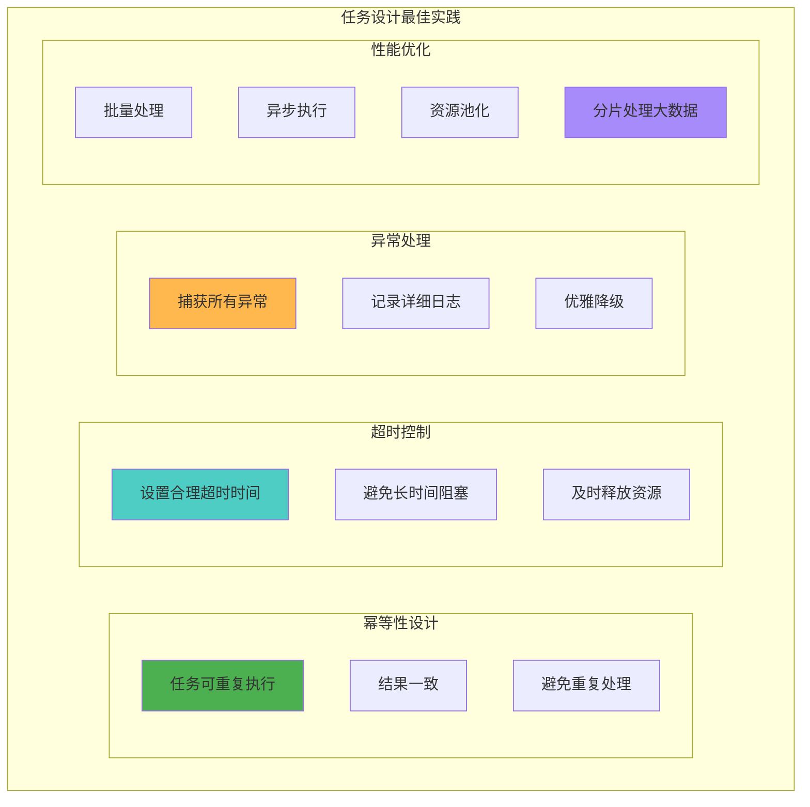
```mermaid
graph TB
    subgraph "任务设计最佳实践"
        subgraph "幂等性设计"
            I1[任务可重复执行]
            I2[结果一致]
            I3[避免重复处理]
        end

        subgraph "超时控制"
            T1[设置合理超时时间]
            T2[避免长时间阻塞]
            T3[及时释放资源]
        end

        subgraph "异常处理"
            E1[捕获所有异常]
            E2[记录详细日志]
            E3[优雅降级]
        end

        subgraph "性能优化"
            P1[批量处理]
            P2[异步执行]
            P3[资源池化]
            P4[分片处理大数据]
        end
    end

    style I1 fill:#4CAF50
    style T1 fill:#4ECDC4
    style E1 fill:#FFB84D
    style P4 fill:#A78BFA
```

### 2. 配置建议

| 配置项 | 建议值 | 说明 |
|-------|--------|------|
| 调度线程池 | 200-500 | 根据任务数量调整 |
| 执行器线程池 | 50-200 | 根据任务并发度 |
| 日志保留天数 | 30天 | 定期清理避免膨胀 |
| 心跳周期 | 30秒 | 默认值，无需修改 |
| 调度过期策略 | 忽略 | 避免补偿执行 |
| 阻塞策略 | 串行 | 保证执行顺序 |

### 3. 高可用部署
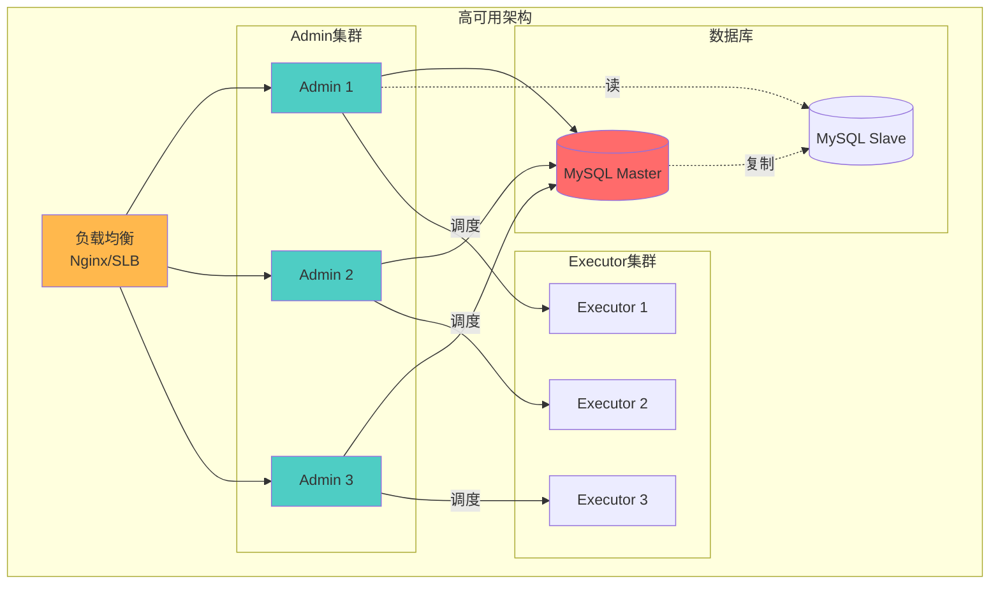
```mermaid
graph TB
    subgraph "高可用架构"
        LB[负载均衡<br/>Nginx/SLB]

        subgraph "Admin集群"
            A1[Admin 1]
            A2[Admin 2]
            A3[Admin 3]
        end

        subgraph "数据库"
            MASTER[(MySQL Master)]
            SLAVE[(MySQL Slave)]

            MASTER -.复制.-> SLAVE
        end

        subgraph "Executor集群"
            E1[Executor 1]
            E2[Executor 2]
            E3[Executor 3]
        end
    end

    LB --> A1
    LB --> A2
    LB --> A3

    A1 --> MASTER
    A2 --> MASTER
    A3 --> MASTER

    A1 -.读.-> SLAVE

    A1 -->|调度| E1
    A2 -->|调度| E2
    A3 -->|调度| E3

    style LB fill:#FFB84D
    style A1 fill:#4ECDC4
    style A2 fill:#4ECDC4
    style A3 fill:#4ECDC4
    style MASTER fill:#FF6B6B
```

### 4. 监控指标
- 任务执行成功率
- 平均执行时长
- 执行器在线数量
- 调度延迟时间
- 任务阻塞次数
- 数据库连接池状态

### 5. 常见问题处理

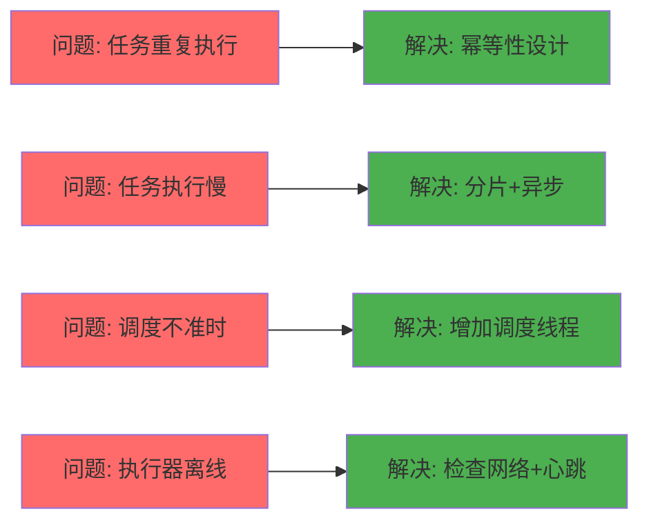
```mermaid
graph LR
    P1[问题: 任务重复执行] --> S1[解决: 幂等性设计]
    P2[问题: 任务执行慢] --> S2[解决: 分片+异步]
    P3[问题: 调度不准时] --> S3[解决: 增加调度线程]
    P4[问题: 执行器离线] --> S4[解决: 检查网络+心跳]

    style P1 fill:#FF6B6B
    style P2 fill:#FF6B6B
    style P3 fill:#FF6B6B
    style P4 fill:#FF6B6B
    style S1 fill:#4CAF50
    style S2 fill:#4CAF50
    style S3 fill:#4CAF50
    style S4 fill:#4CAF50
```

### 6. 安全加固
- 启用 AccessToken 认证
- 配置执行器白名单
- 定期清理历史日志
- 数据库访问权限控制
- Admin 控制台权限管理
